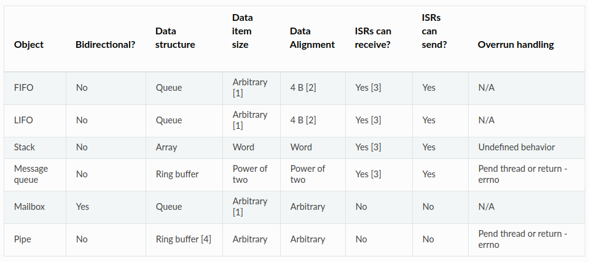
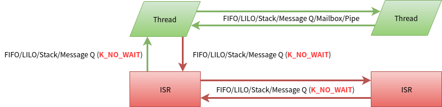

.. _kernel_data_passing:

数据传递
#########

Zephyr OS内核提供6种内核对象用于在Thread/ISR之间传递数据，分别是:

* FIFO: 先进先出

* LIFO: 后进先出

* Stack: 堆栈

* Message Queue： 消息队列

* MailBox：邮箱

* Pipe：管道

官方文档中列出了一个表，和清晰的说明这6种内核对象的特性 |datapassing|

内核对象特性
============

FIFO/LIFO
---------

FIFO使用queue实现，因此FIFO内保存的数据是离散的，不需要占用连续的物理内存。
发送数据插入在queue list的尾部，从queue
list头部接收数据而达到先进先出的目的。
LIFO也使用queue实现，但是是在queue
list的尾部插入数据和读取数据，因此是后进先出。LIFO的其它特性和FIFO一样
FIFO/LIFO传递的数据，并不是将所有数据放入FIFO/LIFO，而是传递指向数据的指针。因此传递的数据可以是任意大小。
可以在ISR中put FIFO/LIFO. 也可在ISR内get FIFO/LIFO，但不能等待。
FIFO/LIFO不限制数据项的多少. 线程get
FIFO/LIFO后，数据项从FIFO/LIFO中删除，如果FIFO/LIFO为空，线程可进行等待。
允许多个线程等待同一个FIFO/LIFO，当FIFO/LIFO有数据时会分配给等待时间最长的最高优先级线程。

Stack
-----

既然有了LIFO为什么还要Stack呢,
lifo是将离散的内容通过lifo串接起来已后进先出的方式管理，没有数量的限制。Stack是将一片连续的内存空间已后进先出的方式管理，在初始化的时候就进行了数量限制。
可以在ISR中push stack。 也可在ISR内pop stack，但不能等待。
stack有大小限制，满了后无法push入数据，之后的行为有stack使用者控制，内核自己不可预期。
允许多个线程等待同一个STACK，当STACK有数据时会分配给等待时间最长的最高优先级线程。

Message Queue
-------------

Message Queue初始化时已经定义了每个Q
message大小，和message的总数量，一个message queue对应一个ring buffer
收发的message都放在ring buffer中。ring
buffer必须按N对齐，N是2的幂，message的大小必须是N的倍数。
message可以通过线程或ISR发送到消息队列。发送message就是将message放入ring
buffer, 如果ring buffer满了，线程内可以等待发送，但ISR中发送不能等待。
多个thread可以向同一个message queue发送message，当ring
buffer满时，所有thread都发生等待，当有ring
buffer有空间时，会让等待时间最长的最高优先级线程发送message。
接收message类似于发送，允许多个thread从同一个message
queue接收message，当ring buffer空时，所有的thread都会等待，当ring
buffer有数据时，会让等待时间最长的最高优先级线程先获得message.
ISR也可以接收message，但不能等待。
线程也可以peek消息队列顶部的消息，peek不会删除ring buffer中的消息。

MailBox
-------

邮箱只允许线程间交换邮件，ISR不能使用邮箱
每个邮件只能由一个线程接收，不支持点对多点或者广播。
邮件收发线程相互知道对方，不是匿名传递。
邮箱消息包含零个或多个字节的消息数据。消息数据的大小和格式是由应用程序定义的，每条消息的格式都可以不同。
邮件数据的有两种形式存放： 1.
消息缓冲区由发送或接收消息的线程提供的内存区域。例如数组或结构变量。 2.
是消息块是从内存池分配的内存区域。

如果一条消息没有消息缓冲区和消息块，称为空消息。消息缓冲区或内存块存在但包含零字节实际数据的消息不是空消息。
发送线程创建一条消息将其发送给邮箱时，该邮件归邮箱所有，直到将其提供给接收线程为止。
发送线程可以将邮件发给指定线程，也可以用K_ANY将其发送给任意线程。接收线程也从指定线程接收邮件指定线程，也可以用K_ANY接收任意线程的邮件。
邮箱可以同步发送：发送阻塞，直到接收线程接收到消息，这是有一个隐性的流控制机制：在接收线程未处理完全，发送线程是阻塞的。
异步发送：发送不阻塞，需要邮箱的用户显示的进行流控制。

管道
----

管道用于两个线程之间流式传递数据，可以同步也可以异步。ISR不能使用PIPE。
如果指定了pipe的size，说明pipe是有ring
buffer的，如果未指定pipe不使用ring buffer。如果有ring
buffer，pipe发送数据没发送完的部分会放入到ring buffer中。
同步发送时，线程可以通过管道发送全部或者部分数据，管道会尝试尝试尽可能多的发送数据，但如果不能立即满足要发送的最小长度，该发送会失败。接收的数据被复制到ring
buffer中或者直接被pipe的读取者读走。

使用限制
========

下图说明了数据传递内核对象的使用限制，绿色的线的常规做法，红色的线的做法虽然允许，但不建议使用。
|limit| 这里提前说一下为什么会有这些限制：
ISR里面不能等待，是因为ISR本身有时间处理的要来，另外这些对象的等待都是依赖thread
wait_q实现，ISR不会支持
ISR不能使用mailbox/pipe，因为mailbox和pipe都是依赖thread的swap_data来交换数据，ISR不会支持。不过异步传输是否可用于ISR值得研究。

参考
====

https://docs.zephyrproject.org/latest/reference/kernel/index.html

