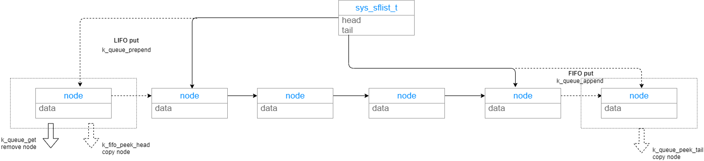

.. _kernel_fifo_lifo:

数据传递-FIFO/LIFO
####################

API
---

相似API
~~~~~~~

FIFO和LIFO API都是用宏包装queue的API实现，它们有一组类似的发送接收API，这里放在一起介绍

**#define k_fifo_init(fifo)** **#define k_lifo_init(lifo)**

作用：初始化一个struct k_fifo/strut k_lifo fifo/lifo: struct

k_fifo/strut k_lifo

**#define k_fifo_put(fifo, data)** **#define k_lifo_put(lifo, data)**

作用：将数据放入fifo/lifo fifo/lifo：数据要放入的fifo/lifo data:

要放入fifo/lifo的数据

**#define k_fifo_alloc_put(fifo, data)** **#define k_lifo_alloc_put(lifo, data)**

作用：fifo/lifo分配一个空间，将数据放入

fifo/lifo：数据要放入的fifo/lifo data: 要放入fifo/lifo的数据

**#define k_fifo_get(fifo, timeout)** **#define k_lifo_get(lifo,timeout)**

作用：从fifo/lifo读出数据 fifo/lifo：要读的fifo/lifo data:
读出的数据

FIFO特殊API
~~~~~~~~~~~

FIFO比LIFO多一些API
**#define k_fifo_cancel_wait(fifo)**

作用：放弃等待，让第一个等待的fifo的thread退出pending，k_fifo_get的数据将是NULL

fifo: 操作的fifo

**#define k_fifo_put_list(fifo, head, tail)**

作用：将一个单链表加入到fifo中 fifo: 操作的fifo head: 单链表的第一个节点

tail: 单链表的最后一个节点

**#define k_fifo_put_slist(fifo, list)**

作用：将一个单链表加入到fifo中，这里单链表对象为sys_slist_t fifo:

操作的fifo list: sys_slist_t 单链表

**#define k_fifo_is_empty(fifo)**

作用：检查fifo是否为空

fifo: 要检查的fifo

**#define k_fifo_peek_head(fifo)**

作用：peek fifo头部上的节点(下个将会被read的数据)，但不会将数据从fifo删除

fifo: 被peek的fifo 返回：返回peek的数据

**#define k_fifo_peek_tail(fifo)**

作用: peek fifo尾部上的节点(FIFO中最后进入的数据)，但不会将数据从fifo删除
fifo: 被peek的fifo 返回：返回peek的数据

使用说明
--------

可以在ISR中put fifo/lifo.也可在ISR内get fifo/fifo，但不能等待。
fifo/lifo不限制数据项的多少。

初始化
~~~~~~

经过初始化的fifo/lifo才能被使用，下面两种方法是一样的，显示定义

::

   struct k_fifo my_fifo;
   struct k_lifo my_lifo;

   k_fifo_init(&my_fifo);
   k_lifo_init(&my_lifo);

隐式定义：

::

   K_FIFO_DEFINE(my_fifo);
   K_LIFO_DEFINE(my_lifo);

写数据
~~~~~~

这里用fifo演示put，用Lifo演示alloc_put

::

   //使用put发送数据，最开始的word必须保留，用于存放queue，这也就是为什么要求4对其的原因
   //使用alloc_put没有这个限制
   struct data_item_t {
       void *fifo_reserved;   /* 1st word reserved for use by fifo */
       ...
   };

   struct data_item_t fifo_tx_data;
   char lifo_tx_data[32];

   void producer_thread(int unused1, int unused2, int unused3)
   {
       while (1) {
           /* create data item to send */
           //fifo_tx_data使用的是put，因此最开始的4个字节不能使用
           fifo_tx_data = ...
           lifo_tx_data = ...

           /* send data to consumers */
           k_fifo_put(&my_fifo, &fifo_tx_data);
           //alloc_put时，queue会从线程池中分配出内存存放lifo，所以不需要保留开始4个字节
           //在get时，queue会自动将其释放掉
           k_lifo_alloc_put(&my_lifo, &lifo_tx_data);

           ...
       }
   }

读数据
~~~~~~

::

   void consumer_fifo_thread(int unused1, int unused2, int unused3)
   {
       struct data_item_t  *rx_data;

       while (1) {
           rx_data = k_fifo_get(&my_fifo, K_FOREVER);

           /* process fifo data item */
           ...
       }
   }

   void consumer_lifo_thread(int unused1, int unused2, int unused3)
   {
       struct data_item_t  *rx_data;

       while (1) {
           rx_data = k_lifo_get(&my_lifo, K_FOREVER);

           /* process lifo data item */
           ...
       }
   }

实现
====

前面已经提到过fifo/lifo都是使用queue实现，fifo/lifo是直接包queue的API,每一个fifo/lifo API都对应一个queue的API，可以说fifo/lifo就是queue的使用方法不一样，先看结构体就可以看出使用的就是queue

FIFO/LIFO
-----------

::

   struct k_fifo {
       struct k_queue _queue;
   };

   struct k_lifo {
       struct k_queue _queue;
   };

每个fifo/lifo都有一个对应的queue API，这里列出来,更详细的可以看include/kernel.h，下面斜体加粗的就是fifo/lifo区别所在
k_fifo_init->k_queue_init k_fifo_cancel_wait->k_queue_cancel_wait
**k_fifo_put->k_queue_append**
**k_fifo_alloc_put->k_queue_alloc_append**
k_fifo_put_list->k_queue_append_list
k_fifo_put_slist->k_queue_merge_slist k_fifo_get->k_queue_get
k_fifo_is_empty->k_queue_is_empty k_fifo_peek_head->k_queue_peek_head
k_fifo_peek_tail->k_queue_peek_tail k_lifo_init->k_queue_init
**k_lifo_put->k_queue_prepend**
**k_lifo_alloc_put->k_queue_alloc_prepend** k_lifo_get->k_queue_get

Queue
-----

从上一节可以看出FIFO就是用queue实现的，因此我们继续分析queue

Queue初始化
~~~~~~~~~~~

初始化：建立一个wait_q，建立一个单项标志链表

添加数据到queue
~~~~~~~~~~~~~~~

添加数据到queue基本都是通过queue_insert完成
k_queue_append->queue_insert： 在链表尾部插入
k_queue_insert->queue_insert: 在指定节点后插入
k_queue_prepend->queue_insert：在链表头部插入
z_impl_k_queue_alloc_append->queue_insert：从thread
pool中分配节点，并插入到尾部
z_impl_k_queue_alloc_prepend->queue_insert：从thread
pool中分配节点，并插入到头部 z_impl_k_queue_peek_head ->
z_queue_node_peek: 从链表中读取头，但不删除该节点
z_impl_k_queue_peek_tail -> z_queue_node_peek:
从链表中读取尾，但不删除该节点

::

   static s32_t queue_insert(struct k_queue *queue, void *prev, void *data,
                 bool alloc)
   {
       k_spinlock_key_t key = k_spin_lock(&queue->lock);
   #if !defined(CONFIG_POLL)
       struct k_thread *first_pending_thread;

       //获取等待queue的thread，如果有的话，将数据提供给该thread，引发调度，直接返回
       first_pending_thread = z_unpend_first_thread(&queue->wait_q);

       if (first_pending_thread != NULL) {
           prepare_thread_to_run(first_pending_thread, data);
           z_reschedule(&queue->lock, key);
           return 0;
       }
   #endif /* !CONFIG_POLL */

       /* Only need to actually allocate if no threads are pending */
       if (alloc) {
           //要alloc节点空间
           struct alloc_node *anode;
           //从线程池中alloc节点空间
           //并初始化数据
           anode = z_thread_malloc(sizeof(*anode));
           if (anode == NULL) {
               k_spin_unlock(&queue->lock, key);
               return -ENOMEM;
           }
           anode->data = data;
           //初始化节点的时候，设置标志为1，表示是alloc的，在get的时候就需要释放
           sys_sfnode_init(&anode->node, 0x1);
           data = anode;
       } else {
           //如果data中自带节点，则无需alloc
           sys_sfnode_init(data, 0x0);
       }
       //将节点插入到指定节点之后
       //prev如果为NULL，data节点会被插入到单链表的最开始
       sys_sflist_insert(&queue->data_q, prev, data);

       //如果配置了poll，会通知queue条件已经满足
   #if defined(CONFIG_POLL)
       handle_poll_events(queue, K_POLL_STATE_DATA_AVAILABLE);
   #endif /* CONFIG_POLL */

       //引发调度
       z_reschedule(&queue->lock, key);
       return 0;
   }

当传入参数data是净数据时(没有在data的最开始预留node位置)，那么在insert的使用需要用alloc指定要分配节点

从Queue中读取数据
~~~~~~~~~~~~~~~~~

使用k_queue_get->z_impl_k_queue_get从queue中读取数据，读取数据时数据从queue中删除，实际的删除动作就是从链表中将节点移除

::

   void *z_impl_k_queue_get(struct k_queue *queue, s32_t timeout)
   {
       k_spinlock_key_t key = k_spin_lock(&queue->lock);
       void *data;

       if (likely(!sys_sflist_is_empty(&queue->data_q))) {
           sys_sfnode_t *node;
           //如果链表不为空，从链表中取出头节点
           node = sys_sflist_get_not_empty(&queue->data_q);
           //从节点中取出数据，如果node是从线程池中分配的，将其释放
           data = z_queue_node_peek(node, true);
           k_spin_unlock(&queue->lock, key);
           //取到数据后立即返回
           return data;
       }

       if (timeout == K_NO_WAIT) {
           k_spin_unlock(&queue->lock, key);
           return NULL;
       }

   #if defined(CONFIG_POLL)
       k_spin_unlock(&queue->lock, key);

       return k_queue_poll(queue, timeout);

   #else
       //没有取到数据，进入等待
       //可以结合发送看，如果有线程在等待queue数据，那么新进入queue的数据是不会进入链表的
       int ret = z_pend_curr(&queue->lock, key, &queue->wait_q, timeout);

       return (ret != 0) ? NULL : _current->base.swap_data;
   #endif /* CONFIG_POLL */
   }

从node中提取数据
~~~~~~~~~~~~~~~~

从链表中peek或者移出的node，需要使用下面API从node中提取数据

::

   void *z_queue_node_peek(sys_sfnode_t *node, bool needs_free)
   {
       void *ret;

       if ((node != NULL) && (sys_sfnode_flags_get(node) != (u8_t)0)) {
           //检查到flag 不为0，说明加入链表的node是从线程池中分配
           struct alloc_node *anode;

           //这里取出数据后释放node
           anode = CONTAINER_OF(node, struct alloc_node, node);
           ret = anode->data;
           if (needs_free) {
               k_free(anode);
           }
       } else {
           //不是从线程池分配的node，直接返回
           ret = (void *)node;
       }

       return ret;
   }

如果是移出的node在Insert的时候是从线程池alloc出来的，那么在这里需要needs_free=true指定要free空间。如果是Peek的node数据时，则只用提取数据，例如：

::

   static inline void *z_impl_k_queue_peek_head(struct k_queue *queue)
   {
       return z_queue_node_peek(sys_sflist_peek_head(&queue->data_q), false);
   }

   static inline void *z_impl_k_queue_peek_tail(struct k_queue *queue)
   {
       return z_queue_node_peek(sys_sflist_peek_tail(&queue->data_q), false);
   }

放弃等待数据
~~~~~~~~~~~~

k_queue_get的时候如果queue内没有数据，允许进行等待。等待期间可以使用k_queue_cancel_wait放弃等待

::

   void z_impl_k_queue_cancel_wait(struct k_queue *queue)
   {
       k_spinlock_key_t key = k_spin_lock(&queue->lock);
   #if !defined(CONFIG_POLL)
       struct k_thread *first_pending_thread;
       //获取正在等待的第一个线程
       first_pending_thread = z_unpend_first_thread(&queue->wait_q);

       //让该线程退出等待
       if (first_pending_thread != NULL) {
           prepare_thread_to_run(first_pending_thread, NULL);
       }
   #else
       handle_poll_events(queue, K_POLL_STATE_CANCELLED);
   #endif /* !CONFIG_POLL */
       //重调度
       z_reschedule(&queue->lock, key);
   }

关于poll
~~~~~~~~

一般情况下queue等待数据是通过让其thread
等待queue的wait_q实现，一旦配置poll后将不再使用该机制，而是通过poll，queue
get使用k_queue_poll等待queue有数据，因此可能和其它thread等待poll条件发生冲突

::

   static void *k_queue_poll(struct k_queue *queue, s32_t timeout)
   {
       struct k_poll_event event;
       int err, elapsed = 0, done = 0;
       k_spinlock_key_t key;
       void *val;
       u32_t start;
       //初始化要等待的条件
       k_poll_event_init(&event, K_POLL_TYPE_FIFO_DATA_AVAILABLE,
                 K_POLL_MODE_NOTIFY_ONLY, queue);

       if (timeout != K_FOREVER) {
           start = k_uptime_get_32();
       }

       do {
           event.state = K_POLL_STATE_NOT_READY;
               //开始poll
           err = k_poll(&event, 1, timeout - elapsed);

           if (err && err != -EAGAIN) {
               return NULL;
           }
           //通知后去链表拿数据
           key = k_spin_lock(&queue->lock);
           val = z_queue_node_peek(sys_sflist_get(&queue->data_q), true);
           k_spin_unlock(&queue->lock, key);

           //如果没拿到数据，说明可能被其它thread将数据拿走，需要重新等待
           if ((val == NULL) && (timeout != K_FOREVER)) {
               elapsed = k_uptime_get_32() - start;
               done = elapsed > timeout;
           }
       } while (!val && !done);

       return val;
   }

插入链表数据
~~~~~~~~~~~~

queue也提供2个API将数据以链表的形式插入到queue中,区别是k_queue_append_list插入后不会影响被插入链表，而k_queue_merge_slist插入链表后会把链表清空

::

   int k_queue_append_list(struct k_queue *queue, void *head, void *tail)
   {
       /* invalid head or tail of list */
       CHECKIF(head == NULL || tail == NULL) {
           return -EINVAL;
       }

       k_spinlock_key_t key = k_spin_lock(&queue->lock);
   #if !defined(CONFIG_POLL)
       struct k_thread *thread = NULL;
       //有等待的thread全部取出来消化这个链表
       //注意，消化完后原来的链表还在
       if (head != NULL) {
           thread = z_unpend_first_thread(&queue->wait_q);
       }

       while ((head != NULL) && (thread != NULL)) {
           prepare_thread_to_run(thread, head);
           head = *(void **)head;
           thread = z_unpend_first_thread(&queue->wait_q);
       }

       //没有消化完的加入到queue中
       if (head != NULL) {
           sys_sflist_append_list(&queue->data_q, head, tail);
       }

   #else
       sys_sflist_append_list(&queue->data_q, head, tail);
       handle_poll_events(queue, K_POLL_STATE_DATA_AVAILABLE);
   #endif /* !CONFIG_POLL */

       z_reschedule(&queue->lock, key);

       return 0;
   }

::

   int k_queue_merge_slist(struct k_queue *queue, sys_slist_t *list)
   {
       int ret;

       /* list must not be empty */
       CHECKIF(sys_slist_is_empty(list)) {
           return -EINVAL;
       }

        //和k_queue_append_list功能一样
       ret = k_queue_append_list(queue, list->head, list->tail);
       CHECKIF(ret != 0) {
           return ret;
       }
       //但消化完链表后，原有链表被清空
       sys_slist_init(list);

       return 0;
   }

图例
----

下面用一张图简单说明FIFO/LIFO和queue操作之间的关系 |QUEUE|
可以看到FIFO是通过k_queue_appen将数据加入到queue的链表尾，LIFO通过k_queue_prepend将数据加入到queue的链表头，而FIFO/LIFO读数据都是用k_queue_get从链表头读数据，所以达到了FIFO先进先出，LIFO后进先出的目的。

参考
====

https://docs.zephyrproject.org/latest/reference/kernel/data_passing/fifos.html
https://docs.zephyrproject.org/latest/reference/kernel/data_passing/lifos.html

