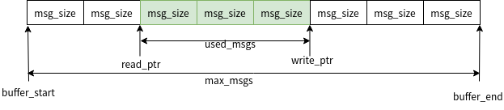

.. _kernel_msgq:

数据传递-消息队列
####################

使用
====

API
---

Message queue的API有下面10个全部声明在kernel.h中，每个函数都有参数\ ``struct k_msgq *msgq``\.都是指该函数操作或者使用的msgq后面就不在单独列出说明

**void k_msgq_init(struct k_msgq q, char buffer, size_t msg_size, u32_tmax_msgs);**

作用：初始化一个msgq, 内存由使用者分配

buffer: msgq的buffer，需要由使用者分配，大小为msg_size*max_msgs

msg_size: msgq中每个message的大小 max_mags: msgq中最多容纳的message数量

**__syscall int k_msgq_alloc_init(struct k_msgq *msgq, size_t msg_size,u32_t max_msgs);**

作用：初始化一个msgq, 内存由msgq从线程池中分配

msg_size: msgq中每个message的大小

max_mags: msgq中最多容纳的message数量

**int k_msgq_cleanup(struct k_msgq* msgq);**

作用：释放k_msgq_alloc_init分配msgq内存

**__syscall int k_msgq_put(struct k_msgq *msgq, void*\ data, s32_t timeout);**

作用：将message放入到msgq

data：message数据

timeout:等待时间，单位ms。K_NO_WAIT不等待, K_FOREVER一直等

返回值：放入成功返回0

**__syscall int k_msgq_get(struct k_msgq *msgq, void* data, s32_t timeout);**

作用：从msgq读出message

data：message数据

timeout: 等待时间，单位ms。K_NO_WAIT不等待,K_FOREVER一直等 返回值：读出成功返回0

**__syscall int k_msgq_peek(struct k_msgq *msgq, void* data);**

作用：peek msgq

data: peek到的message

返回： peek到数据返回0

**__syscall void k_msgq_purge(struct k_msgq *msgq);**

作用：清空msgq中的message

**__syscall u32_t k_msgq_num_free_get(struct k_msgq *msgq);**

作用：获取msgq还可以放多少个message

返回值：空闲数目

**__syscall void k_msgq_get_attrs(struct k_msgq *msgq, struct k_msgq_attrs* attrs);**

作用：获取msgq的信息，也就是message的大小，总数量和已使用数量，都放在struct k_msgq_attrs 内

**__syscall u32_t k_msgq_num_used_get(struct k_msgq *msgq);**

作用：获取msgq中有多少个message
返回值：message数目

使用说明
--------

可以在ISR中put msgq.也可在ISR内get msgq，但不能等待。
msgq必须事先指定message的大小和个数。大小需要是2的幂对齐。
msgq用于异步传输小数据。msgq在读写时需要锁中断，因此不建议用来传输大数据。

初始化
~~~~~~

初始化一个queue, 由用户分配内存

::

   struct data_item_type {     //message的数据结构
       u32_t field1;
       u32_t field2;
       u32_t field3;
   };

   char __aligned(4) my_msgq_buffer[10 * sizeof(data_item_type)];
   struct k_msgq my_msgq;

   k_msgq_init(&my_msgq, my_msgq_buffer, sizeof(data_item_type), 10);

由message queue自己在线程池中分配

::

   k_msgq_alloc_init(&my_msgq, sizeof(data_item_type), 10);

写入message
~~~~~~~~~~~

运行在线程或者ISR中写入message，ISR中写入时不能发生等待。示例如下

::

   void producer_thread(void)
   {
       struct data_item_t data;

       while (1) {
           /* create data item to send (e.g. measurement, timestamp, ...) */
           data = ...

           /* send data to consumers */
           while (k_msgq_put(&my_msgq, &data, K_NO_WAIT) != 0) {
               /* message queue is full: purge old data & try again */
               //这里purge并不是必要步骤，是否需要进行purge根据实际应用由用户自己选择
               k_msgq_purge(&my_msgq);
           }

           /* data item was successfully added to message queue */
       }
   }

读message
~~~~~~~~~

可以将message从msgq读出, 之后msgq中不再有该message

::

   void consumer_thread(void)
   {
       struct data_item_t data;

       while (1) {
           /* get a data item */
           k_msgq_get(&my_msgq, &data, K_FOREVER);

           /* process data item */
           ...
       }
   }

也可以只是peek，该message任然保留在msgq中

::

   void consumer_thread(void)
   {
       struct data_item_t data;

       while (1) {
           /* read a data item by peeking into the queue */
           if(0 == k_msgq_peek(&my_msgq, &data)){
               /* process data item */
           }
           ...
       }
   }

实现
====

msgq的实现代码在zephyr/kernel/msg_q.c中，msgq是以ringbuffer的模式进行管理，在初始化的时候建立ringbuffer，读写数据时都是以固定的单位大小从ringbuffer内读写数据。
msgq的数据结构如下

::

   struct k_msgq {
       _wait_q_t wait_q;       //wait_q用于控制msgq的等待
       struct k_spinlock lock;  //msgq多线程保护锁
       size_t msg_size;        // message的大小
       u32_t max_msgs;     // msgq最大容纳message的个数
       char *buffer_start;     //msgq ringbuffer的开始地址
       char *buffer_end;       //msgq ringbuffer的结束地址
       char *read_ptr;             //msgq ringbuffer的读指针
       char *write_ptr;        //msgq ringbuffer的写指针
       u32_t used_msgs;    //msgq中有效message的个数
       u8_t flags;                     //msgq的ringbuffer从线程池分配标志
   };

示意图 如下，每读或者写一个message，读写指针就向前移动msg_size |msgq|

初始化/释放
-----------

初始化msgq就是对struct_msgq中的各成员进行初始化

::

   void k_msgq_init(struct k_msgq *msgq, char *buffer, size_t msg_size,
            u32_t max_msgs)
   {
       //初始化各成员
       msgq->msg_size = msg_size;
       msgq->max_msgs = max_msgs;
       msgq->buffer_start = buffer;
       msgq->buffer_end = buffer + (max_msgs * msg_size);
       msgq->read_ptr = buffer;
       msgq->write_ptr = buffer;
       msgq->used_msgs = 0;
       msgq->flags = 0;        // msgq ringbuffer是由使用者分配，这里设为0
       z_waitq_init(&msgq->wait_q);    //初始化msgq的wait_q
       msgq->lock = (struct k_spinlock) {};

       z_object_init(msgq);
   }

k_msgq_alloc_init->z_impl_k_msgq_alloc_init,
msgq内存从线程池中分配，再使用k_msgq_init初始化

::

   int z_impl_k_msgq_alloc_init(struct k_msgq *msgq, size_t msg_size,
                   u32_t max_msgs)
   {
       void *buffer;
       int ret;
       size_t total_size;

       //计算msg_size乘max_msgs，并检查是否溢出，实际调用的是__builtin_mul_overflow
       if (size_mul_overflow(msg_size, max_msgs, &total_size)) {
           ret = -EINVAL;
       } else {
           //从线程池中分配msgq的ringbuffer 内存
           buffer = z_thread_malloc(total_size);
           if (buffer != NULL) {
               //初始化各变量
               k_msgq_init(msgq, buffer, msg_size, max_msgs);
               //使用K_MSGQ_FLAG_ALLOC在flags中标识ringbuffer是从线程池中分配
               msgq->flags = K_MSGQ_FLAG_ALLOC;
               ret = 0;
           } else {
               ret = -ENOMEM;
           }
       }

       return ret;
   }

如果msgq是从线程池中分配的内存，可以使用k_msgq_cleanup将其释放

::

   int k_msgq_cleanup(struct k_msgq *msgq)
   {
       //如果还有thread在等待msgq，说明不能释放，退出
       CHECKIF(z_waitq_head(&msgq->wait_q) != NULL) {
           return -EBUSY;
       }

       //判断alloc标志，并释放内存
       if ((msgq->flags & K_MSGQ_FLAG_ALLOC) != 0) {
           k_free(msgq->buffer_start);
           msgq->flags &= ~K_MSGQ_FLAG_ALLOC;
       }
       return 0;
   }

mssage操作
----------

写msgq
~~~~~~

k_msgq_put->z_impl_k_msgq_put

::

   int z_impl_k_msgq_put(struct k_msgq *msgq, void *data, s32_t timeout)
   {
       //isr内写msgq不能等
       __ASSERT(!arch_is_in_isr() || timeout == K_NO_WAIT, "");

       struct k_thread *pending_thread;
       k_spinlock_key_t key;
       int result;

       key = k_spin_lock(&msgq->lock);

       if (msgq->used_msgs < msgq->max_msgs) {
           //msgq中ringbuffer有空间

           //检查是否有thread在等待读取msgq的message
           pending_thread = z_unpend_first_thread(&msgq->wait_q);
           if (pending_thread != NULL) {
               //有线程在等message，直接将该数据提供给等待线程
               (void)memcpy(pending_thread->base.swap_data, data,
                      msgq->msg_size);
               //等待线程拿到数据后，让等待线程ready，并重新调度
               arch_thread_return_value_set(pending_thread, 0);
               z_ready_thread(pending_thread);
               z_reschedule(&msgq->lock, key);
               return 0;
           } else {
               //没有线程需要数据，则将数据放入ringbuffer
               (void)memcpy(msgq->write_ptr, data, msgq->msg_size);
               msgq->write_ptr += msgq->msg_size;
               if (msgq->write_ptr == msgq->buffer_end) {
                   msgq->write_ptr = msgq->buffer_start;
               }
               //更新msgq剩余的message数
               msgq->used_msgs++;
           }
           result = 0;
       } else if (timeout == K_NO_WAIT) {
           //msgq ringbuffer满，且不等待就立即退出
           result = -ENOMSG;
       } else {
           //msgq 满，将message放入swap_data，等待其它thread来读
           _current->base.swap_data = data;
           return z_pend_curr(&msgq->lock, key, &msgq->wait_q, timeout);
       }

       k_spin_unlock(&msgq->lock, key);

       return result;
   }

读msgq
~~~~~~

k_msgq_get->z_impl_k_msgq_get

::

   int z_impl_k_msgq_get(struct k_msgq *msgq, void *data, s32_t timeout)
   {
           //isr内读msgq不能等
       __ASSERT(!arch_is_in_isr() || timeout == K_NO_WAIT, "");

       k_spinlock_key_t key;
       struct k_thread *pending_thread;
       int result;

       key = k_spin_lock(&msgq->lock);

       if (msgq->used_msgs > 0) {
           //ringbuffer中有数据，直接从ringbuffer中读出message
           (void)memcpy(data, msgq->read_ptr, msgq->msg_size);
           msgq->read_ptr += msgq->msg_size;
           if (msgq->read_ptr == msgq->buffer_end) {
               msgq->read_ptr = msgq->buffer_start;
           }

           //更新msgq剩余的message数
           msgq->used_msgs--;

           //此时ringbuffer有空闲空间，如果有thead在等待写msgq，则在这里写入
           pending_thread = z_unpend_first_thread(&msgq->wait_q);
           if (pending_thread != NULL) {
               /* add thread's message to queue */
               (void)memcpy(msgq->write_ptr, pending_thread->base.swap_data,
                      msgq->msg_size);
               msgq->write_ptr += msgq->msg_size;
               if (msgq->write_ptr == msgq->buffer_end) {
                   msgq->write_ptr = msgq->buffer_start;
               }
               //更新msgq剩余的message数
               msgq->used_msgs++;

               //等待写入msgq的thread在写入msgq后变为ready，并重新调度
               arch_thread_return_value_set(pending_thread, 0);
               z_ready_thread(pending_thread);
               z_reschedule(&msgq->lock, key);
               return 0;
           }
           result = 0;
       } else if (timeout == K_NO_WAIT) {
           /msgq ringbuffer空，且不等待就立即退出
           result = -ENOMSG;
       } else {
           //msgq 空，将message放入swap_data，等待其它thread来写
           _current->base.swap_data = data;
           return z_pend_curr(&msgq->lock, key, &msgq->wait_q, timeout);
       }

       k_spin_unlock(&msgq->lock, key);

       return result;
   }

peek msgq
~~~~~~~~~

也可以通过peek读message，该方式不会将message从msgq的ringbuffer中删除
k_msgq_peek->z_impl_k_msgq_peek

::

   int z_impl_k_msgq_peek(struct k_msgq *msgq, void *data)
   {
       k_spinlock_key_t key;
       int result;

       key = k_spin_lock(&msgq->lock);

       if (msgq->used_msgs > 0) {
           //ringbuffer中有数据直接copy出去
           (void)memcpy(data, msgq->read_ptr, msgq->msg_size);
           result = 0;
       } else {
           //ringbuffer中有无数据返回错误
           result = -ENOMSG;
       }

       k_spin_unlock(&msgq->lock, key);

       return result;
   }

清空msgq
~~~~~~~~

当不需要msgq中的数据时可以使用k_msgq_purge清空
k_msgq_purge->z_impl_k_msgq_purge

::

   void z_impl_k_msgq_purge(struct k_msgq *msgq)
   {
       k_spinlock_key_t key;
       struct k_thread *pending_thread;

       key = k_spin_lock(&msgq->lock);

       //清空ringbuffer前，会先让等待读msgq的thead将message读走
       while ((pending_thread = z_unpend_first_thread(&msgq->wait_q)) != NULL) {
           arch_thread_return_value_set(pending_thread, -ENOMSG);
           z_ready_thread(pending_thread);
       }

       //复位 ringbuffer
       msgq->used_msgs = 0;
       msgq->read_ptr = msgq->write_ptr;

       z_reschedule(&msgq->lock, key);
   }

获取msgq信息
------------

获取msgq的信息函数实现很简单结合前面k_msgq的结构体很容易理解，这里就不再注释分析了

::

   void z_impl_k_msgq_get_attrs(struct k_msgq *msgq, struct k_msgq_attrs *attrs)
   {
       attrs->msg_size = msgq->msg_size;
       attrs->max_msgs = msgq->max_msgs;
       attrs->used_msgs = msgq->used_msgs;
   }

   static inline u32_t z_impl_k_msgq_num_free_get(struct k_msgq *msgq)
   {
       return msgq->max_msgs - msgq->used_msgs;
   }

   static inline u32_t z_impl_k_msgq_num_used_get(struct k_msgq *msgq)
   {
       return msgq->used_msgs;
   }

参考
====

https://gcc.gnu.org/onlinedocs/gcc/Integer-Overflow-Builtins.html
https://docs.zephyrproject.org/latest/reference/kernel/data_passing/message_queues.html

