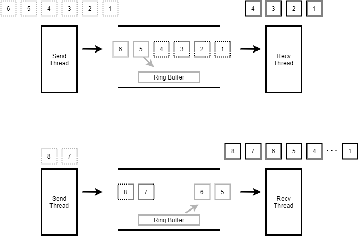

.. _kernel_pipe:

数据同步-管道
###############

原理简介
========

Zephyr的Pipe用于线程向线程发送字节流，不能用于ISR。一个pipe只能做到单工或是半双工。Zephyr在设计上虽然支持对同一pipe进行同时多线程发和多线程收，但一般情况下都只建议做一发一收。

Ring buffer工作原理
====================
Zephyr允许定义任意数量的管道，最大数量只由可用内存的量决定。管道的尺寸由管道的ring-buffer大小决定，管道内也可以不带ring-buffer。
线程发送数据到管道时，如果数据没有被其它线程接收完，剩余的数据会被放入到管道内的ring-buffer。线程接收数据时会先从ring
buffer内读取，再从pipe内等待发送的线程接收数据。
如下图示，第一次发送数据1\ :sub:`6,接收线程只收1`\ 4，剩余5，6会被放入ring
buffer。下一次接收时会先从ring buffer中读出
5，6.再接收发送线程发送的7,8。 |image0|
``

收发行为
--------

发送时会指定发送到pipe数据的尺寸，和允许最小传送尺寸。如果实际传送尺寸小于最小传送尺寸，且不等待传送，将立即返回失败。
接收时会指定从pipe接收数据的尺寸，和允许最小接收尺寸。如果实际接收的尺寸小于最小接收尺寸，且不等待接收，将立即返回失败。
从pipe收发数据，只要实际收发数据的尺寸大于指定最小收发尺寸，本次收发都是成功的。
接收和发送都允许等待，收发数据没有达到指定的尺寸前会保持阻塞，如果超时后实际收发数据的尺寸小于指定的最小尺寸，将返回失败。
如果实际接收和发送数据的尺寸已经满足指定的最小尺寸，将记录退出，不会保持阻塞等待收发所有指定数据。

使用
====

API
---

``#define K_PIPE_DEFINE(name, pipe_buffer_size, pipe_align)``

作用:定义一个k_pipe，为其分配ring buffer

name: k_pipe name

pipe_buffer_size: pipe内ring buffer的大小

pipe_align: 定义静态数组座位ring buffer，该参数指定该数组的对齐大小，只能是2的幂

``void k_pipe_init(struct k_pipe *pipe, unsigned char *buffer, size_t size)``

作用:初始化k_pipe, 并为其指定ring buffer

pipe: 要初始化的pipe

buffer: ringbuffer地址

size: ring buffer大小

``int k_pipe_alloc_init(struct k_pipe *pipe, size_t size)``

作用:初始化k_pipe, 并为其分配ring buffer

pipe: 要初始化的pipe

size: 分配ring buffer大小

返回值：0表示成功，-ENOMEM表示memory不足

``int k_pipe_cleanup(struct k_pipe *pipe)``
作用:释放k_pipe_alloc_init分配的ring buffer pipe: 要释放buffer的pipe
返回值：0表示成功，-EAGAIN表示目前正在使用无法释放

``int k_pipe_put(struct k_pipe *pipe, void *data, size_t bytes_to_write, size_t *bytes_written, size_t min_xfer, k_timeout_t timeout)``

作用:发送数据到pipe

pipe: 管道

data: 发送数据的地址

bytes_to_write：发送数据的尺寸

bytes_written： 实际发送的尺寸

min_xfer： 最小发送尺寸

timeout：等待时间，单位ms。K_NO_WAIT不等待, K_FOREVER一直等

返回值：0表示成功，-EINVAL表示参数错误，-EIO表示未等待且未传送任何数据，-EAGAIN表示传送的数据单数据量小于min_xfer

``int k_pipe_get(struct k_pipe *pipe, void *data, size_t bytes_to_read, size_t *bytes_read, size_t min_xfer, k_timeout_t timeout)``

作用:从pipe接收数据

pipe: 管道

data: 发送数据的地址

bytes_to_read: 接收数据的尺寸 bytes_read 实际接收的尺寸 min_xfer 最小接收尺寸

timeout：等待时间，单位ms。K_NO_WAIT不等待, K_FOREVER一直等

返回值：0表示成功，-EINVAL表示参数错误，-EIO表示未等待且未收到任何数据，-EAGAIN表示接收的数据单数据量小于min_xfer

``size_t k_pipe_read_avail(struct k_pipe *pipe)``

作用:获取pipe内有多少有效数据，也就是ring buffer的有效数据大小

pipe: 管道 返回值：可读数据大小

``size_t k_pipe_write_avail(struct k_pipe *pipe)``

作用:获取可以向管道写多少数据，也就是ring buffer内的空闲空间大小

pipe: 管道 返回值：可写数据大小

使用说明
--------

初始化
~~~~~~

先定义初始化一个pipe，一共有三种方式
使用宏，宏会定义一个数组作为pipe的ring buffer

::

   K_PIPE_DEFINE(my_pipe, 100, 4);

使用函数初始化，需要自己定义一个数组作为ring buffer

::

   unsigned char __aligned(4) my_ring_buffer[100];
   struct k_pipe my_pipe;

   k_pipe_init(&my_pipe, my_ring_buffer, sizeof(my_ring_buffer));

使用函数初始化，由pipe自己分配内存作为ring buffer

::

   struct k_pipe my_pipe;
   k_pipe_alloc_init(&my_pipe, 100)

用k_pipe_alloc_init初始化的pipe，不再使用时需要用k_pipe_cleanup释放其分配的ring buffer

::

   k_pipe_cleanup(&my_pipe)

写pipe
~~~~~~

发送数据需要分三种情况处理，如下分析

::

   struct message_header {
       ...
   };

   void producer_thread(void)
   {
       unsigned char *data;
       size_t total_size;
       size_t bytes_written;
       int    rc;
       ...

       while (1) {
           /* 准备要发送到pipe的数据，尺寸大于struct message_header */
           data = ...;
           total_size = ...;

           /* 通过pipe发送数据 */
           rc = k_pipe_put(&my_pipe, data, total_size, &bytes_written,
                           sizeof(struct message_header), K_NO_WAIT);

           if (rc < 0) {
               //数据头没有发送完，发送失败处理
               ...
           } else if (bytes_written < total_size) {
               //数据头发送完，但数据没全发送，进行处理（例如继续发送）
               ...
           } else {
               //所有数据都发送完毕
               ...
           }
       }
   }

读pipe
~~~~~~

接收数据也分三种情况处理，如下分析

::

   void consumer_thread(void)
   {
       unsigned char buffer[120];
       size_t   bytes_read;
       struct message_header  *header = (struct message_header *)buffer;

       while (1) {
           rc = k_pipe_get(&my_pipe, buffer, sizeof(buffer), &bytes_read,
                           sizeof(header), K_MSEC(100));

           if ((rc < 0) || (bytes_read < sizeof (header))) {
               //数据头未收全，接收失败处理
               ...
           } else if (header->num_data_bytes + sizeof(header) > bytes_read) {
               //数据头收完，但数据没收全，进行处理（例如跳到下一次接收）
               ...
           } else {
               //所有数据接收完毕
               ...
           }
       }
   }

实现
====

该小节通过对管道内核代码的分析，理解Zephyr是如何实现以上描述的功能特性.
pipe的实现代码在kernel:raw-latex:`\pipes`.c中

pipe结构体
----------

一个管道主要是由ring buffer和两个wait_q组成，ring buffer最为pipe
buffer， 两个wait_q用于管理发送和接收线程，如下定义：

::

   struct k_pipe {

       //下面5个字段是ring buffer管理用，使用的是常规管理方法，本文不做分析
       unsigned char *buffer;
       size_t         size;
       size_t         bytes_used;
       size_t         read_index;
       size_t         write_index;

       //同步锁
       struct k_spinlock lock;

       //两个wait_q，readers用于管理读pipe的线程，writers用于管理写pipe的线程
       struct {
           _wait_q_t      readers; /**< Reader wait queue */
           _wait_q_t      writers; /**< Writer wait queue */
       } wait_q;           /** Wait queue */

       //pipe flag，如果pipe的ring buffer是pipe分配的，该flag之为K_PIPE_FLAG_ALLOC
       uint8_t        flags;       /**< Flags */
   };

初始化
------

k_pipe_init和K_PIPE_DEFINE主要就是初始化ring buffer和两个wait_q,流程简单，查看代码即可。
这里看一下k_pipe_alloc_init和k_pipe_cleanup的流程
k_pipe_alloc_init->z_vrfy_k_pipe_alloc_init->z_impl_k_pipe_alloc_init

::

   int z_impl_k_pipe_alloc_init(struct k_pipe *pipe, size_t size)
   {
       void *buffer;
       int ret;

       if (size != 0U) {
           /从线程resource_pool内分配内存作为ring buffer
           buffer = z_thread_malloc(size);
           if (buffer != NULL) {
               //初始化pipe
               k_pipe_init(pipe, buffer, size);
               //标记该pipe用的ring buffer是自己分配的内存
               pipe->flags = K_PIPE_FLAG_ALLOC;
               ret = 0;
           } else {
               ret = -ENOMEM;
           }
       } else {
           //不需要ring buffer，直接进行初始化
           k_pipe_init(pipe, NULL, 0);
           ret = 0;
       }

       return ret;
   }

   int k_pipe_cleanup(struct k_pipe *pipe)
   {
       SYS_PORT_TRACING_OBJ_FUNC_ENTER(k_pipe, cleanup, pipe);

       //pipe使用中，不允许释放ring buffer
       CHECKIF(z_waitq_head(&pipe->wait_q.readers) != NULL ||
               z_waitq_head(&pipe->wait_q.writers) != NULL) {
           return -EAGAIN;
       }

       //检查ring buffer是从线程resource_pool分配，释放内存
       if ((pipe->flags & K_PIPE_FLAG_ALLOC) != 0U) {
           k_free(pipe->buffer);
           pipe->buffer = NULL;
           pipe->flags &= ~K_PIPE_FLAG_ALLOC;
       }

       return 0;
   }

写pipe
------

写pipe的函数调用关系如下：
k_pipe_put->z_vrfy_k_pipe_put->z_impl_k_pipe_put->z_pipe_put_internal
z_pipe_put_internal内主要做下面几件事

* 根据写pipe的数据长度，从readers wait_q中将读pipe的线程放入读pipe链表
* 将数据依次拷贝给读pipe链表中的线程
* 如果写数据还有剩余，将剩余数据放入pipe buffer中
* 发送数据达到最小尺寸，立即退出发送
* 发送数据未达到最小尺寸，等待发送超时

::

   int z_pipe_put_internal(struct k_pipe *pipe, struct k_pipe_async *async_desc,
                unsigned char *data, size_t bytes_to_write,
                size_t *bytes_written, size_t min_xfer,
                k_timeout_t timeout)
   {
       struct k_thread    *reader;
       struct k_pipe_desc *desc;
       sys_dlist_t    xfer_list;
       size_t         num_bytes_written = 0;
       size_t         bytes_copied;

       //参数判断
       CHECKIF((min_xfer > bytes_to_write) || bytes_written == NULL) {
           return -EINVAL;
       }

       k_spinlock_key_t key = k_spin_lock(&pipe->lock);

       //将等待读pipe的thread从readers wait_q中移除并加入到链表xfer_list中
       //最后一个读pipe的thread不加入到xfer_list中，而是直接放入到reader
       if (!pipe_xfer_prepare(&xfer_list, &reader, &pipe->wait_q.readers,
                   pipe->size - pipe->bytes_used, bytes_to_write,
                   min_xfer, timeout)) {
           k_spin_unlock(&pipe->lock, key);

           //读pipe的总量小于写pipe的min_xfer，且写pipe不等待，立即返回失败
           //该部分原理在pipe_xfer_prepare中分析
           *bytes_written = 0;

           return -EIO;
       }

       z_sched_lock();
       k_spin_unlock(&pipe->lock, key);

       //遍历读pipe thread 链表xfer_list
       struct k_thread *thread = (struct k_thread *)
                     sys_dlist_get(&xfer_list);
       while (thread != NULL) {
           //用pipe_xfer依次将写pipe的数据拷贝到读pipe thread中
           desc = (struct k_pipe_desc *)thread->base.swap_data;
           bytes_copied = pipe_xfer(desc->buffer, desc->bytes_to_xfer,
                         data + num_bytes_written,
                         bytes_to_write - num_bytes_written);

           num_bytes_written   += bytes_copied;
           desc->buffer        += bytes_copied;
           desc->bytes_to_xfer -= bytes_copied;

           //读pipe的thread已经拿到全部数据，被转为就绪
           z_ready_thread(thread);

           thread = (struct k_thread *)sys_dlist_get(&xfer_list);
       }

       //最后一个等待读pipe的线程从pipe中读取数据，因为可能数据可能读不够，因此不将其转为就绪态
       if (reader != NULL) {
           desc = (struct k_pipe_desc *)reader->base.swap_data;
           bytes_copied = pipe_xfer(desc->buffer, desc->bytes_to_xfer,
                         data + num_bytes_written,
                         bytes_to_write - num_bytes_written);

           num_bytes_written   += bytes_copied;
           desc->buffer        += bytes_copied;
           desc->bytes_to_xfer -= bytes_copied;
       }

       //写pipe数据如果还有剩余，放入pipe ring buffer
       num_bytes_written +=
           pipe_buffer_put(pipe, data + num_bytes_written,
                    bytes_to_write - num_bytes_written);

       //写pipe的数据如果已经消耗完，返回成功
       if (num_bytes_written == bytes_to_write) {
           *bytes_written = num_bytes_written;
           k_sched_unlock();

           return 0;
       }

       //如果写pipe已经达到最小传送尺寸min_xfer，立即返回成功不再等待
       if (!K_TIMEOUT_EQ(timeout, K_NO_WAIT)
           && num_bytes_written >= min_xfer
           && min_xfer > 0U) {
           *bytes_written = num_bytes_written;
           k_sched_unlock();

           return 0;
       }

       struct k_pipe_desc  pipe_desc;

       pipe_desc.buffer         = data + num_bytes_written;
       pipe_desc.bytes_to_xfer  = bytes_to_write - num_bytes_written;
       //如果写pipe数据未被读完且需要等待超时的，将线程加入到wirters wait_q，等待读pipe线程
       if (!K_TIMEOUT_EQ(timeout, K_NO_WAIT)) {
           _current->base.swap_data = &pipe_desc;

           k_spinlock_key_t key2 = k_spin_lock(&pipe->lock);
           z_sched_unlock_no_reschedule();
           (void)z_pend_curr(&pipe->lock, key2,
                    &pipe->wait_q.writers, timeout);
       } else {
           k_sched_unlock();
       }

       //计算实际写pipe数据，并和min_xfer比较，检查是否达到最小传送量
       *bytes_written = bytes_to_write - pipe_desc.bytes_to_xfer;
       int ret = pipe_return_code(min_xfer, pipe_desc.bytes_to_xfer,
                    bytes_to_write);

       return ret;
   }

读pipe
------

读pipe的函数调用关系如下：
k_pipe_get->z_vrfy_k_pipe_get->z_impl_k_pipe_get
z_impl_k_pipe_get的流程和写pipe是对称的，主要做下面几件事

* 根据读pipe的数据长度，从writers wait_q中将写pipe的线程放入
* 将pipe内ring buffer的数据拷贝给读pipe线程
* 写pipe链表中写pipe线程的数据依次拷贝给读pipe线程
* 如果写pipe线程链表的数据还有剩余，将其写到pipe buffer内
* 接收数据达到最小尺寸，立即退出接收
* 接收数据未达到最小尺寸，等待接收超时

::

   int z_impl_k_pipe_get(struct k_pipe *pipe, void *data, size_t bytes_to_read,
                size_t *bytes_read, size_t min_xfer, k_timeout_t timeout)
   {
       struct k_thread    *writer;
       struct k_pipe_desc *desc;
       sys_dlist_t    xfer_list;
       size_t         num_bytes_read = 0;
       size_t         bytes_copied;

       //检查参数
       CHECKIF((min_xfer > bytes_to_read) || bytes_read == NULL) {
           return -EINVAL;
       }

       k_spinlock_key_t key = k_spin_lock(&pipe->lock);

       //将等待写pipe的thread从writers wait_q中移除并加入到链表xfer_list中
       //最后一个读pipe的thread不加入到xfer_list中，而是直接放入到writer
       //这里计算长度没有考虑pipe buffer内的数据，因此链表内待接收数据和buffer数据的总和可能会大于读pipe需要的长度
       if (!pipe_xfer_prepare(&xfer_list, &writer, &pipe->wait_q.writers,
                   pipe->bytes_used, bytes_to_read,
                   min_xfer, timeout)) {
           k_spin_unlock(&pipe->lock, key);
           *bytes_read = 0;

           //写pipe的总量小于读pipe的min_xfer，且写pipe不等待，立即返回失败
           //该部分原理在pipe_xfer_prepare中分析

           return -EIO;
       }

       z_sched_lock();
       k_spin_unlock(&pipe->lock, key);

       //先从pipe buffer中读数据
       num_bytes_read = pipe_buffer_get(pipe, data, bytes_to_read);

       //遍历读pipe thread 链表xfer_list
       struct k_thread *thread = (struct k_thread *)
                     sys_dlist_get(&xfer_list);
       while ((thread != NULL) && (num_bytes_read < bytes_to_read)) {
           //用pipe_xfer依次将写pipe的thread的数据拷贝到读pipe thread中
           desc = (struct k_pipe_desc *)thread->base.swap_data;
           bytes_copied = pipe_xfer((uint8_t *)data + num_bytes_read,
                         bytes_to_read - num_bytes_read,
                         desc->buffer, desc->bytes_to_xfer);

           num_bytes_read       += bytes_copied;
           desc->buffer         += bytes_copied;
           desc->bytes_to_xfer  -= bytes_copied;

           //由于前面从pipe buffer中还接收了数据，因此链表未遍历完就可能将需要读的数据量读够
           if (num_bytes_read == bytes_to_read) {
               break;
           }

           //数据被读完的thread转为就绪太
           pipe_thread_ready(thread);

           thread = (struct k_thread *)sys_dlist_get(&xfer_list);
       }

       //buffer和链表内的数据都被读完了，还没读够长度，则从writer中读
       if ((writer != NULL) && (num_bytes_read < bytes_to_read)) {
           desc = (struct k_pipe_desc *)writer->base.swap_data;
           bytes_copied = pipe_xfer((uint8_t *)data + num_bytes_read,
                         bytes_to_read - num_bytes_read,
                         desc->buffer, desc->bytes_to_xfer);

           num_bytes_read       += bytes_copied;
           desc->buffer         += bytes_copied;
           desc->bytes_to_xfer  -= bytes_copied;
       }

       //由于前面从pipe buffer中还接收了数据，因此链表未遍历完就可能将需要读的数据量读够，链表中剩余的数据将放入pipe buffer
       while (thread != NULL) {
           desc = (struct k_pipe_desc *)thread->base.swap_data;
           bytes_copied = pipe_buffer_put(pipe, desc->buffer,
                           desc->bytes_to_xfer);

           desc->buffer         += bytes_copied;
           desc->bytes_to_xfer  -= bytes_copied;

           //链表中写pipe线程数据被放入pipe buffer后，该线程转为就绪态
           pipe_thread_ready(thread);

           thread = (struct k_thread *)sys_dlist_get(&xfer_list);
       }

       //由于前面从pipe buffer中和链表中还接收了数据，因此writer中的数据可能会有剩，需要将writer中的剩余数据放入到pipe buffer中
       //由于pipe buffer可能无法放下wirter中所有写pipe的数据，因此wirter线程不能转为就绪
       if (writer != NULL) {
           desc = (struct k_pipe_desc *)writer->base.swap_data;
           bytes_copied = pipe_buffer_put(pipe, desc->buffer,
                           desc->bytes_to_xfer);

           desc->buffer         += bytes_copied;
           desc->bytes_to_xfer  -= bytes_copied;
       }

       //数据读全，立即返回
       if (num_bytes_read == bytes_to_read) {
           k_sched_unlock();

           *bytes_read = num_bytes_read;

           SYS_PORT_TRACING_OBJ_FUNC_EXIT(k_pipe, get, pipe, timeout, 0);

           return 0;
       }

       //如果读pipe已经达到最小传送尺寸min_xfer，立即返回成功不再等待
       if (!K_TIMEOUT_EQ(timeout, K_NO_WAIT)
           && num_bytes_read >= min_xfer
           && min_xfer > 0U) {
           k_sched_unlock();

           *bytes_read = num_bytes_read;

           SYS_PORT_TRACING_OBJ_FUNC_EXIT(k_pipe, get, pipe, timeout, 0);

           return 0;
       }

       struct k_pipe_desc  pipe_desc;

       pipe_desc.buffer        = (uint8_t *)data + num_bytes_read;
       pipe_desc.bytes_to_xfer = bytes_to_read - num_bytes_read;
       //如果读pipe未达到最小尺寸且需要等待超时的，将线程加入到readers wait_q，等待写pipe线程
       if (!K_TIMEOUT_EQ(timeout, K_NO_WAIT)) {
           _current->base.swap_data = &pipe_desc;
           k_spinlock_key_t key2 = k_spin_lock(&pipe->lock);

           z_sched_unlock_no_reschedule();
           (void)z_pend_curr(&pipe->lock, key2,
                    &pipe->wait_q.readers, timeout);
       } else {
           k_sched_unlock();
       }

       //计算实际读pipe数据，并和min_xfer比较，检查是否达到最小传送量
       *bytes_read = bytes_to_read - pipe_desc.bytes_to_xfer;
       int ret = pipe_return_code(min_xfer, pipe_desc.bytes_to_xfer,
                    bytes_to_read);

       return ret;
   }

内部API
-------

从前面分析可以看出读写pipe的操作在流程上基本是对称的，都依赖于pipe_xfer_prepare，pipe_xfer。
另外就是操作pipe buffer： pipe_buffer_put/pipe_buffer_get，前面提到过pipe buffer的操作就是ring buffer操作，本文不做分析。 pipe_xfer_prepare传输列表准备，读写都是用的这个函数，至少传入的参数不一样

::

   static bool pipe_xfer_prepare(sys_dlist_t      *xfer_list,
                      struct k_thread **waiter,
                      _wait_q_t        *wait_q,
                      size_t            pipe_space,
                      size_t            bytes_to_xfer,
                      size_t            min_xfer,
                      k_timeout_t           timeout)
   {
       struct k_thread  *thread;
       struct k_pipe_desc *desc;
       size_t num_bytes = 0;

       //不等待的传送，检查需求是否大于最小尺寸，如果需求不满足最小尺寸就立即退出
       //对于写pipe来说：检查readers wait_q中等待读pipe线程需求的数据量是否大于要写的最小尺寸
       //对于读pipe来说：检查writers wait_q中等待写pipe线程拥有的数据量是否大于要读的最小尺寸
       if (K_TIMEOUT_EQ(timeout, K_NO_WAIT)) {
           _WAIT_Q_FOR_EACH(wait_q, thread) {
               desc = (struct k_pipe_desc *)thread->base.swap_data;

               num_bytes += desc->bytes_to_xfer;

               if (num_bytes >= bytes_to_xfer) {
                   break;
               }
           }

           if (num_bytes + pipe_space < min_xfer) {
               return false;
           }
       }

       sys_dlist_init(xfer_list);
       num_bytes = 0;

       //遍历writer或reader wait_q，按照需求数量的长度将线程加入链表xfer_list内，加入的同时从wait_q中移除
       while ((thread = z_waitq_head(wait_q)) != NULL) {
           desc = (struct k_pipe_desc *)thread->base.swap_data;
           num_bytes += desc->bytes_to_xfer;

           if (num_bytes > bytes_to_xfer) {
               //最后一个thread不会被加入到链表中，因为该thread的数据需求不会被全部满足
               break;
           }

           //其它thread会被从wait_q中移除并加入到链表中，这些thread的数据需求(读或写)将会被全部满足
           z_unpend_thread(thread);
           sys_dlist_append(xfer_list, &thread->base.qnode_dlist);
       }

       //将最后一个thread送出，外部会对没满足完的需求另做处理
       *waiter = (num_bytes > bytes_to_xfer) ? thread : NULL;

       return true;
   }

pipe_xfer非常简单就是copy数据：

::

   static size_t pipe_xfer(unsigned char *dest, size_t dest_size,
                const unsigned char *src, size_t src_size)
   {
       size_t num_bytes = MIN(dest_size, src_size);
       const unsigned char *end = src + num_bytes;

       while (src != end) {
           *dest = *src;
           dest++;
           src++;
       }

       return num_bytes;
   }

但也由此可知道，虽然pipe可以用来传送大量数据，但如果为了提高效率，减少数据copy还是使用消息列队等方式直接传送内存的指针比较好。

参考
====

https://docs.zephyrproject.org/latest/reference/kernel/data_passing/pipes.html

