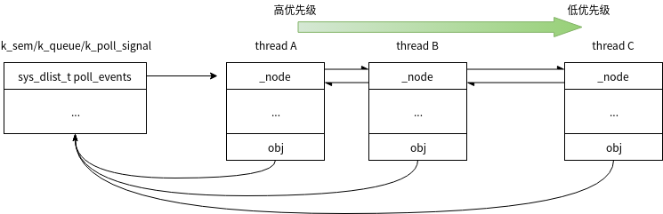
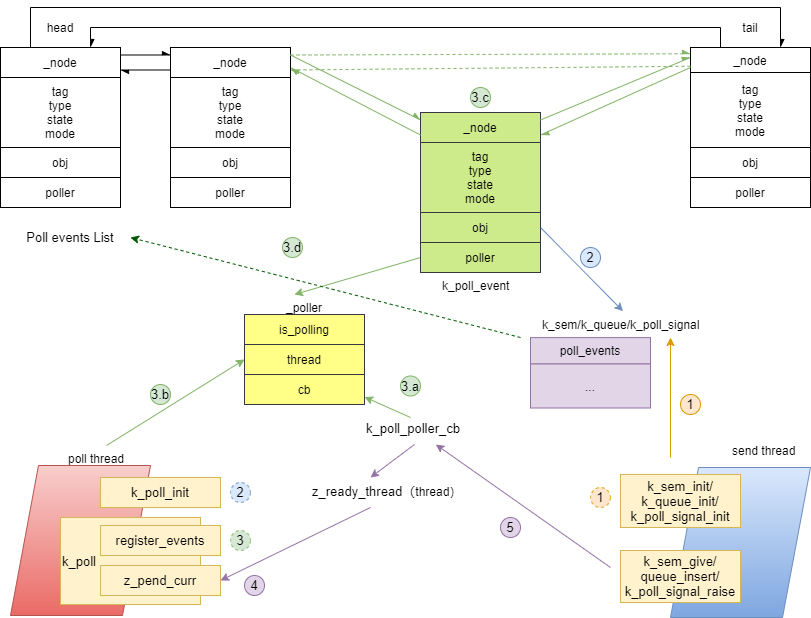

.. _kernel_poll:

同步-轮询
##########

轮询API用于同时等待多个条件中的任意一个满足条件。

使用
=====

API
-----

**void k_poll_event_init(struct k_poll_event event, u32_t type, int mode,void\ obj)**

- 作用：初始化一个k_poll_event实例，这个实例将被k_poll轮询

- event:要初始化的event

- type：event轮询条件的类型，目前支援三种类型，当使用K_POLL_TYPE_IGNORE表示该event将被禁用

    - K_POLL_TYPE_SIGNAL：poll event 信号
    - K_POLL_TYPE_SEM_AVAILABLE: 信号量
    - K_POLL_TYPE_FIFO_DATA_AVAILABLE：FIFO，实际上FIFO使用queue实现的，真正的等待条件是queue

mode：触发模式，目前只支持K_POLL_MODE_NOTIFY_ONLY

obj：轮询的条件，和type要对应，可以是内核对象或者event signal

**int k_poll(struct k_poll_event *events, int num_events, s32_ttimeout)**

- 作用：等待一个或者多个event条件有效。 events: 等待事件的数组

- num_events: 等待事件的数量，也就是events的个数

- timeout:等待超时，单位ms。K_NO_WAIT不等待, K_FOREVER一直等

- 返回值：当返回0时表示一个或者多个条件有效

注意事项：

- k_poll收到条件有效时，仅仅是通知到线程该内核对象有效，还需要线程使用代码主动获取内核对象。

- k_poll返回0时，有可能是多个条件有效，需要循环使用k_poll,每次循环后检查那个event有效，需要将其状态设置为K_POLL_STATE_NOT_READY。

**void k_poll_signal_init(struct k_poll_signal *signal)**

- 作用：初始化一个poll signal, 该信号可以作为poll event的条件

- signal：要初始化的poll signal

**int k_poll_signal_raise(struct k_poll_signal *signal, int result)**

- 作用：发送poll signal

- signal: 要发送的signal

- result: 信号的一个标记值，poll收到信号后可以获得这个值

**void k_poll_signal_reset(struct k_poll_signal *signal)**

- 作用：reset signal，如果一个signal被发送，但未被poll前，可以使用该API reset掉

- signal: 要reset的signal

**void k_poll_signal_check(struct k_poll_signal *signal, unsigned int* signaled, int *result)**

- 作用：获取被轮询信号的状态和值

- signal: 要获取的signal

- signaled: 是否已发送signal

- result: 如果已发送，这里是发送的值

使用说明
--------

poll由于可以等待多个条件，因此可以将每个条件一个线程等的形式转化为一个线程等多个条件，减少线程节约线程堆栈。
由于poll被通知并未获取到内核对象，因此实际使用中应劲量避免有将有竞争的内核对象做为poll条件。

内核对象作为poll条件
~~~~~~~~~~~~~~~~~~~~

初始化poll 条件

::

   struct k_poll_event events[2];

   void poll_init(void)
   {
       //将my_sem做为poll条件，注意my_sem，需要单独初始化
       k_poll_event_init(&events[0],
                         K_POLL_TYPE_SEM_AVAILABLE,
                         K_POLL_MODE_NOTIFY_ONLY,
                         &my_sem);

       //将my_fifo做为poll条件，注意my_fifo，需要单独初始化
       k_poll_event_init(&events[1],
                         K_POLL_TYPE_FIFO_DATA_AVAILABLE,
                         K_POLL_MODE_NOTIFY_ONLY,
                         &my_fifo);
   }

以上初始化也可以用下面方式代替, 同样注意my_sem和my_fifo需要单独初始化

::

   struct k_poll_event events[2] = {
       K_POLL_EVENT_STATIC_INITIALIZER(K_POLL_TYPE_SEM_AVAILABLE,
                                       K_POLL_MODE_NOTIFY_ONLY,
                                       &my_sem, 0),
       K_POLL_EVENT_STATIC_INITIALIZER(K_POLL_TYPE_FIFO_DATA_AVAILABLE,
                                       K_POLL_MODE_NOTIFY_ONLY,
                                       &my_fifo, 0),
   };

poll等待和处理

::

   void poll_thread(void)
   {
       for(;;) {
           rc = k_poll(events, 2, K_FOREVER);
           if (events[0].state == K_POLL_STATE_SEM_AVAILABLE) {
               k_sem_take(events[0].sem, 0);
               //handle sem
           } else if (events[1].state == K_POLL_STATE_FIFO_DATA_AVAILABLE) {
               data = k_fifo_get(events[1].fifo, 0);
               // handle data
           }
           events[0].state = K_POLL_STATE_NOT_READY;
           events[1].state = K_POLL_STATE_NOT_READY;
       }
   }

poll 信号处理
~~~~~~~~~~~~~

初始化信号，并将其作为poll条件

::

   struct k_poll_signal signal;
   void poll_init(void)
   {
       k_poll_signal_init(&signal);

        struct k_poll_event events[1] = {
           K_POLL_EVENT_INITIALIZER(K_POLL_TYPE_SIGNAL,
                                    K_POLL_MODE_NOTIFY_ONLY,
                                    &signal),
       };
   }

线程A poll信号是否发生

::

   void thread_A(void){
       while(1){
               k_poll(events, 1, K_FOREVER);

               if (events[0].signal->result == 0x1337) {
                   // A-OK!
               } else {
                   // weird error
               }

               events[0].signal->signaled = 0;
               events[0].state = K_POLL_STATE_NOT_READY;
       }
   }

发送信号

::

   k_poll_signal_raise(&signal, 0x1337);

实现
====

通知机制
--------

poll初始化时一个等待条件对应一个poll event poll将维护一个poll
events链表，当一个thread进行k_poll等待某些条件时，这些条件对应的的poll
event被加入到poll event链表中。同时会将等待的thread和一个poller
存储在poll event中。然后thread进入超时等待，处于pending状态。
当等待条件发生时，等待条件会主动呼叫对应自己poll
event内poller中的callback，callback内会将poll
event的thread从pending状态变为ready状态。
之后thread继续运行，将已经就绪的poll event从链表中取出，完成k_poll轮询。

数据结构及类型介绍
------------------

一个poll event的结构体如下

::

   struct k_poll_event {
       sys_dnode_t _node;          // poll event链表用

       struct _poller *poller;     //poller，存储回调和polling状态

       u32_t tag:8;                        //zephyr内核没有使用，可以被用户设置

       u32_t type:_POLL_NUM_TYPES;     //poll 条件类型

       u32_t state:_POLL_NUM_STATES;   //poll event的状态

       u32_t mode:1;       //poll 模式，目前只有一种

       u32_t unused:_POLL_EVENT_NUM_UNUSED_BITS;

       union {             //保存poll条件的句柄
           void *obj;
           struct k_poll_signal *signal;
           struct k_sem *sem;
           struct k_fifo *fifo;
           struct k_queue *queue;
       };
   };

poll条件类型定义如下：

::

   enum _poll_types_bits {
       /* can be used to ignore an event */
       _POLL_TYPE_IGNORE,

       /* to be signaled by k_poll_signal_raise() */
       _POLL_TYPE_SIGNAL,

       /* semaphore availability */
       _POLL_TYPE_SEM_AVAILABLE,

       /* queue/fifo/lifo data availability */
       _POLL_TYPE_DATA_AVAILABLE,

       _POLL_NUM_TYPES
   };

可以看出等待条件有3种poll signal, sem, queue(fifo/lifo是由queue实现)

poll状态类型定义如下

::

   enum _poll_states_bits {
       /* default state when creating event */
       _POLL_STATE_NOT_READY,

       /* signaled by k_poll_signal_raise() */
       _POLL_STATE_SIGNALED,

       /* semaphore is available */
       _POLL_STATE_SEM_AVAILABLE,

       /* data is available to read on queue/fifo/lifo */
       _POLL_STATE_DATA_AVAILABLE,

       /* queue/fifo/lifo wait was cancelled */
       _POLL_STATE_CANCELLED,

       _POLL_NUM_STATES
   };

一个poller的结构体如下

::

   struct _poller {
       volatile bool is_polling;       //是否需要polling
       struct k_thread *thread;     //是那个thread在polling
       _poller_cb_t cb;                    // 条件满足时使用这个cb通知条件已发生
   };

初始化
------

k_poll_event_init其实就是将k_poll_event和等待条件建立联系，然后初始化类型和状态

::

   void k_poll_event_init(struct k_poll_event *event, u32_t type,
                  int mode, void *obj)
   {
       event->poller = NULL;
       /* event->tag is left uninitialized: the user will set it if needed */
       event->type = type;
       event->state = K_POLL_STATE_NOT_READY;
       event->mode = mode;
       event->unused = 0U;
       event->obj = obj;       //将等待条件和poll event建立联系
   }

等待及通知
----------

k_poll等待
~~~~~~~~~~

k_poll首先给要poll
的event注册poller，然后等待条件发生，细节代码比较多，这里只列出主要的分析
k_poll->z_impl_k_poll

::

   int z_impl_k_poll(struct k_poll_event *events, int num_events, s32_t timeout)
   {
       int events_registered;
       k_spinlock_key_t key;
       //为poll event准备poller
       struct _poller poller = { .is_polling = true,
                     .thread     = _current,                       //将当前thread提供给poller，将来callback时让该thread退出pending
                     .cb         = k_poll_poller_cb };

       __ASSERT(!arch_is_in_isr(), "");        // isr中不允许使用k_poll
       __ASSERT(events != NULL, "NULL events\n");
       __ASSERT(num_events >= 0, "<0 events\n");

       //注册poller给poll event，并检查是否已经有就绪的条件
       events_registered = register_events(events, num_events, &poller,
                           (timeout == K_NO_WAIT));

       key = k_spin_lock(&lock);

       //如果已经有就绪的条件，清除注册的poll event，并返回表示已经有条件满足
       if (!poller.is_polling) {
           clear_event_registrations(events, events_registered, key);
           k_spin_unlock(&lock, key);
           return 0;
       }

       poller.is_polling = false;
       //如果不等待条件满足，直接退出
       if (timeout == K_NO_WAIT) {
           k_spin_unlock(&lock, key);
           return -EAGAIN;
       }

       //等待条件满足，条件满足时会通过poller的callback通知该thread退出等待状态
       //等待超时会发生调度
       _wait_q_t wait_q = Z_WAIT_Q_INIT(&wait_q);
       int swap_rc = z_pend_curr(&lock, key, &wait_q, timeout);

       //等待结束后将清楚掉已经注册的event
       key = k_spin_lock(&lock);
       clear_event_registrations(events, events_registered, key);
       k_spin_unlock(&lock, key);

       return swap_rc;
   }

这里也可以看到条件满足后只是k_poll不再阻塞直接退出，也就是前面提到的k_poll等到内核对象条件满足后并不会获取内核对象(sem/queue/poll signal)。

条件满足通知
~~~~~~~~~~~~

前面说过3种内核对象条件都会通知，3个对内对象最后都是使用signal_poll_event进行通知，k_sem_give中会通知poll，流程是z_impl_k_sem_give->handle_poll_events其实现如下

::

   static inline void handle_poll_events(struct k_sem *sem)
   {
   #ifdef CONFIG_POLL
       z_handle_obj_poll_events(&sem->poll_events, K_POLL_STATE_SEM_AVAILABLE);
   #else
       ARG_UNUSED(sem);
   #endif
   }

k_queue在k_queue_insert/k_queue_append->queue_insert->handle_poll_events其实现如下

::

   static inline void handle_poll_events(struct k_queue *queue, u32_t state)
   {
       z_handle_obj_poll_events(&queue->poll_events, state);
   }

::

   void z_handle_obj_poll_events(sys_dlist_t *events, u32_t state)
   {
       struct k_poll_event *poll_event;

       poll_event = (struct k_poll_event *)sys_dlist_get(events);
       if (poll_event != NULL) {
           (void) signal_poll_event(poll_event, state);    //通知条件满足
       }
   }

k_poll_signal在z_impl_k_poll_signal_raise->signal_poll_event因此无论那种条件最后都是通过signal_poll_event通知等待线程条件已经就绪，signal_poll_event中使用poller中callback对thread进行通知，前面分析可以看到callback是k_poll_poller_cb

::

   static int k_poll_poller_cb(struct k_poll_event *event, u32_t state)
   {
       struct k_thread *thread = event->poller->thread;

       if (!z_is_thread_pending(thread)) {
           return 0;
       }

       if (z_is_thread_timeout_expired(thread)) {
           return -EAGAIN;
       }

       z_unpend_thread(thread);
       arch_thread_return_value_set(thread,
           state == K_POLL_STATE_CANCELLED ? -EINTR : 0);

       if (!z_is_thread_ready(thread)) {
           return 0;
       }
       //在这里让等待k_poll的线程就绪，上一节的等待thread就在这里被通知退出等待
       z_ready_thread(thread);

       return 0;
   }

整体流程
~~~~~~~~

再向下分析就是poll
event的管理，这些API比较繁杂，如果分析代码那面陷入细节，下面通过两张附图说明poll的event管理过程。
当创建一个条件对象时(sem/queue/poll signal), 会有一个对应的poll event
list, 每有一个thread对该条件对象进行poll就会加入对应的Poll
event到该链表，加入链表的顺序是按优先级由高到底排列。也就是说一旦条件对象就绪，高优先级thread会先被通知。如下图
|poll_list|

下图为k_poll的整体流程图，说明了操作和poll event管理的对应 |poll|
说明以上流程：
1. 初始化条件对象(sem/Queue/pollsignal)，初始化对象时，该对象的poll_events链表为空
2. 初始化poll_event，将poll_event和条件对象关联(相互指向)，并初始化poll_event相关字段
3. k_poll注册要等待的poll_event，也就是将poll_event加入到条件对象的poll_events链表中，一个条件对象一条链表，每当多一个thread等待这个条件对象时，就会插入一个节点，插入节点
 3.a 为poller指定callback  3.b 为poller指定callback会通知的thread  3.c
将等待的poll_event按线程的优先级顺序插入到条件对象的poll_events链表中
 3.d 为poll_event指定poller
4. k_poll的thread被z_pend_curr开始等待通知
5. 当条件对象发生时(sem/queue/poll signal),会先从这些条件对象的结构体中找到poll_events链表，然后移除第一个节点得到poll_event再通过poller中的callback通知pending的thread就绪，到此时k_poll等待的thread等到条件恢复执行

poll信号
--------

三个等待条件中sem和queue是对外的内核对象，会有其它文章进行分析，这里说一下专门给poll用的poll
signal实现. 数据结构如下

::

   struct k_poll_signal {
       /** PRIVATE - DO NOT TOUCH */
       sys_dlist_t poll_events;    //前面介绍过用于串接等待该signal的poll_event为链表

       unsigned int signaled;      //是否已经发送信号

       int result;     //信号值，就是前面示例中的0x1337
   };

初始化
~~~~~~

k_poll_signal_init->z_impl_k_poll_signal_init

::

   void z_impl_k_poll_signal_init(struct k_poll_signal *signal)
   {
       sys_dlist_init(&signal->poll_events);   //初始化链表
       signal->signaled = 0U;                                  //无信号发送
       /* signal->result is left unitialized */
       z_object_init(signal);
   }

发送信号
~~~~~~~~

k_poll_signal_raise->z_impl_k_poll_signal_raise

::

   int z_impl_k_poll_signal_raise(struct k_poll_signal *signal, int result)
   {
       k_spinlock_key_t key = k_spin_lock(&lock);
       struct k_poll_event *poll_event;

       signal->result = result;    //设置信号值
       signal->signaled = 1U;    //有信号发送

       //从等待的poll event list中取出第一个poll event
       poll_event = (struct k_poll_event *)sys_dlist_get(&signal->poll_events);
       if (poll_event == NULL) {
           k_spin_unlock(&lock, key);
           return 0;
       }

       //通知等待该poll event的信号条件已满足，这里也就会通过poll event中poller->cb 回调k_poll_poller_cb
       int rc = signal_poll_event(poll_event, K_POLL_STATE_SIGNALED);

       z_reschedule(&lock, key);
       return rc;
   }

poll event
----------

register_events
~~~~~~~~~~~~~~~

将等待的poll event加入到条件对象的链表中

::

   static inline int register_events(struct k_poll_event *events,
                     int num_events,
                     struct _poller *poller,
                     bool just_check)
   {
       int events_registered = 0;

       for (int ii = 0; ii < num_events; ii++) {
           k_spinlock_key_t key;
           u32_t state;

           key = k_spin_lock(&lock);
           //使用is_condition_met查询是否条件对象已经满足
           //一些情况下在k_poll前sem/queue/poll signal已经就绪
           if (is_condition_met(&events[ii], &state)) {
               //如果有条件对象就绪，就不再polling，将event状态设置为ready
               set_event_ready(&events[ii], state);
               //将is_polling设置为false，表示无需再polling
               poller->is_polling = false;
           } else if (!just_check && poller->is_polling) {     //对于K_NO_WAIT的k_poll，just_check会传false进来，也就是说只执行前面的检查，看是否有条件对象就绪，如果没有不会进行event注册
               //注册poll event
               int rc = register_event(&events[ii], poller);
               if (rc == 0) {
                   events_registered += 1;
               } else {
                   __ASSERT(false, "unexpected return code\n");
               }
           }
           k_spin_unlock(&lock, key);
       }

条件就绪检查

::

   static inline bool is_condition_met(struct k_poll_event *event, u32_t *state)
   {
       switch (event->type) {
       case K_POLL_TYPE_SEM_AVAILABLE:
           //检查是否有信号
           if (k_sem_count_get(event->sem) > 0) {
               *state = K_POLL_STATE_SEM_AVAILABLE;
               return true;
           }
           break;
       case K_POLL_TYPE_DATA_AVAILABLE:
           //检查queue中是否有数据
           if (!k_queue_is_empty(event->queue)) {
               *state = K_POLL_STATE_FIFO_DATA_AVAILABLE;
               return true;
           }
           break;
       case K_POLL_TYPE_SIGNAL:
           //检查是否已发出poll signal
           if (event->signal->signaled != 0U) {
               *state = K_POLL_STATE_SIGNALED;
               return true;
           }
           break;
       case K_POLL_TYPE_IGNORE:
           break;
       default:
           __ASSERT(false, "invalid event type (0x%x)\n", event->type);
           break;
       }

       return false;
   }

注册event register_event->add_event

::

   static inline int register_event(struct k_poll_event *event,
                    struct _poller *poller)
   {
       //根据不同的条件类型，使用add_event将event注册到条件对象的poll events链表中
       switch (event->type) {
       case K_POLL_TYPE_SEM_AVAILABLE:
           __ASSERT(event->sem != NULL, "invalid semaphore\n");
           add_event(&event->sem->poll_events, event, poller);
           break;
       case K_POLL_TYPE_DATA_AVAILABLE:
           __ASSERT(event->queue != NULL, "invalid queue\n");
           add_event(&event->queue->poll_events, event, poller);
           break;
       case K_POLL_TYPE_SIGNAL:
           __ASSERT(event->signal != NULL, "invalid poll signal\n");
           add_event(&event->signal->poll_events, event, poller);
           break;
       case K_POLL_TYPE_IGNORE:
           /* nothing to do */
           break;
       default:
           __ASSERT(false, "invalid event type\n");
           break;
       }

       //根系poller，之后这个event就会使用这个poller内的callback通知等待thread就绪
       event->poller = poller;

       return 0;
   }

   static inline void add_event(sys_dlist_t *events, struct k_poll_event *event,
                    struct _poller *poller)
   {
       struct k_poll_event *pending;
       //events是一个双向循环链表，里面放的poll event是按等待它thread的优先级从高到底排序
       //这里取最后一个节点，也就是优先级最低的节点
       //如果链表中没有节点，或者是要注册的event所属thread优先级比最低的节点的线程优先级都低，就将注册的event插入到最后
       pending = (struct k_poll_event *)sys_dlist_peek_tail(events);
       if ((pending == NULL) ||
           z_is_t1_higher_prio_than_t2(pending->poller->thread,
                           poller->thread)) {
           sys_dlist_append(events, &event->_node);
           return;
       }

       //遍历整个链表，将Poll event按thread优先级进行插入
       SYS_DLIST_FOR_EACH_CONTAINER(events, pending, _node) {
           if (z_is_t1_higher_prio_than_t2(poller->thread,
                           pending->poller->thread)) {
               sys_dlist_insert(&pending->_node, &event->_node);
               return;
           }
       }

       sys_dlist_append(events, &event->_node);
   }

clear_event_registrations
~~~~~~~~~~~~~~~~~~~~~~~~~

清除event，当poll条件满足后,
k_poll恢复执行，会使用clear_event_registrations将所有注册的event全部清除

::

   static inline void clear_event_registrations(struct k_poll_event *events,
                             int num_events,
                             k_spinlock_key_t key)
   {
       //使用clear_event_registration清除event
       while (num_events--) {
           clear_event_registration(&events[num_events]);
           k_spin_unlock(&lock, key);
           key = k_spin_lock(&lock);
       }
   }
   static inline void clear_event_registration(struct k_poll_event *event)
   {
       bool remove = false;

       //移除poller
       event->poller = NULL;

       //将poll event从链表中移除
       if (remove && sys_dnode_is_linked(&event->_node)) {
           sys_dlist_remove(&event->_node);
       }
   }

再谈k_poll
----------

有了poll event的管理，我们再结合之前的原理来再来分析一次k_poll
k_poll->z_impl_k_poll

::

   int z_impl_k_poll(struct k_poll_event *events, int num_events, s32_t timeout)
   {
       int events_registered;
       k_spinlock_key_t key;

       //为poll event初始化poller，里面包含通知的callback函数k_poll_poller_cb
       struct _poller poller = { .is_polling = true,
                     .thread     = _current,
                     .cb         = k_poll_poller_cb };

       //ISR中不允许k_poll
       __ASSERT(!arch_is_in_isr(), "");

       //检查要poll event的参数
       __ASSERT(events != NULL, "NULL events\n");
       __ASSERT(num_events >= 0, "<0 events\n");

       //注册poll event
       //这里会根据timeout，通知register_events是否只是检查条件就绪，而不真正的注册poll event
       events_registered = register_events(events, num_events, &poller,
                           (timeout == K_NO_WAIT));

       key = k_spin_lock(&lock);

       //前面分析过在register_events时会检查条件对象, 如果条件对象满足会将is_polling设置为false
       //因此检查is_polling为false时，表面已经有条件对象满足，这里就清楚已注册的event，然后直接返回表示已经等到条件对象
       if (!poller.is_polling) {
           clear_event_registrations(events, events_registered, key);
           k_spin_unlock(&lock, key);
           return 0;
       }

       poller.is_polling = false;

       //如果没有条件对象满足，而又不等待就直接退出
       if (timeout == K_NO_WAIT) {
           k_spin_unlock(&lock, key);
           return -EAGAIN;
       }

       _wait_q_t wait_q = Z_WAIT_Q_INIT(&wait_q);
       //将当前线程pending住等待条件满足
       //条件对象满足后会通过poller中的callback让这个等待的thread ready继续执行
       //在timeout 后都没有等待条件对象满足，thread也会继续执行
       int swap_rc = z_pend_curr(&lock, key, &wait_q, timeout);

       //等待到条件满足或者超时，线程退出pending继续执行
       //清除本次注册的Poll event
       key = k_spin_lock(&lock);
       clear_event_registrations(events, events_registered, key);
       k_spin_unlock(&lock, key);

       return swap_rc;
   }

参考
====

https://docs.zephyrproject.org/latest/reference/kernel/other/polling.html

