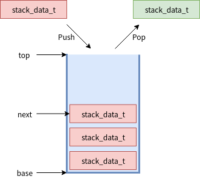

.. _kernel_stack:

数据传递-堆栈
###############

使用
====

API
---

**void k_stack_init(struct k_stack stack, stack_data_t buffer, u32_t num_entries);**

作用：初始化一个stack，stack的内存由使用者分配

stack: 被初始化的stack

buffer: stack使用的内存

num_entries：stack的成员数量

**__syscall s32_t k_stack_alloc_init(struct k_stack *stack, u32_tnum_entries);**

作用：初始化一个stack，stack使用的内存从thread pool分配

stack: 被初始化的stack

num_entries：stack的成员数量

返回值: 0表示初始化成功

**int k_stack_cleanup(struct k_stack* stack);**

作用：释放k_stack_alloc_init中为stack分配的内存

stack: 操作的stack

返回值: 0表示free成功，如果有pop在等待数据时会返回非0

**__syscall int k_stack_push(struct k_stack *stack, stack_data_t data);**

作用：压栈

stack：被压栈的stack

data: 要push的数据

返回值：push成功返回0

**__syscall int k_stack_pop(struct k_stack *stack, stack_data_t* data, s32_t timeout);**

作用：出栈 stack：被出栈的stack

data: pop的数据

timeout: stack没数据时可等待超时，单位ms。K_NO_WAIT不等待, K_FOREVER一直等

返回值：pop成功返回0

使用说明
--------

可以在ISR中push stack.也可在ISR内pop stack，但不能等待。 stack满后,push将会失败。 stack的数据成员是指针类型stack_data_t的大小和CPU位数对应

初始化
~~~~~~~

下面两种方式都可以对stack进行初始化 使用函数

::

   #define MAX_ITEMS 10

   stack_data_t my_stack_array[MAX_ITEMS];
   struct k_stack my_stack;

   k_stack_init(&my_stack, my_stack_array, MAX_ITEMS);

使用宏

::

   K_STACK_DEFINE(my_stack, MAX_ITEMS);

栈操作
~~~~~~

堆栈当中存储的只是数据的指针

::

   struct my_buffer_type {
       int field1;
       ...
       };
   struct my_buffer_type my_buffers[MAX_ITEMS];

   void producer_thread(int unused1, int unused2, int unused3)
   {
       //将数据指针入栈
       for (int i = 0; i < MAX_ITEMS; i++) {
           k_stack_push(&my_stack, (stack_data_t)&my_buffers[i]);
       }
   }

   void consumer_fifo_thread(int unused1, int unused2, int unused3)
   {
       struct my_buffer_type *new_buffer;
       //将数据指针出栈，并进行操作
       k_stack_pop(&buffer_stack, (stack_data_t *)&new_buffer, K_FOREVER);
       new_buffer->field1 = ...
   }

实现
====

数据结构
--------

stack的数据结构如下，wait_q用于pop时无数据等待数据，lock用于多线程访问stack时进行线程保护

::

   struct k_stack {
       _wait_q_t wait_q;
       struct k_spinlock lock;
       stack_data_t *base, *next, *top;
       u8_t flags;
   };

base是栈底,
next是栈顶，top是堆栈最大的位置，也就是说next不能超过top.如下图 |stack|

flag只指示该堆栈的内存是否是从线程池中分配的，如果是用k_stack_alloc_init初始化的堆栈，flag就会被设置为下面的值

::

   #define K_STACK_FLAG_ALLOC  ((u8_t)1)

初始化
------

初始化起始就是将stack的各个指针设置正确

::

   void    (struct k_stack *stack, stack_data_t *buffer,
             u32_t num_entries)
   {
       z_waitq_init(&stack->wait_q);   //初始化wait_q
       stack->lock = (struct k_spinlock) {};
       stack->next = stack->base = buffer; //base指向buffer开始
       stack->top = stack->base + num_entries; //top执行buffer尾部

       z_object_init(stack);
   }

push
----

k_stack_push->z_impl_k_stack_push,分析见注释

::

   int z_impl_k_stack_push(struct k_stack *stack, stack_data_t data)
   {
       struct k_thread *first_pending_thread;
       k_spinlock_key_t key;

       // stack满了，返回
       CHECKIF(stack->next == stack->top) {
           return -ENOMEM;
       }

       key = k_spin_lock(&stack->lock);

       //查看是否有thread已经在等待stack数据
       first_pending_thread = z_unpend_first_thread(&stack->wait_q);

       if (first_pending_thread != NULL) {
           //如果有thread在等stack数据，将push的数据直接给该thread
           //stack指针不做修改
           z_ready_thread(first_pending_thread);

           z_thread_return_value_set_with_data(first_pending_thread,
                              0, (void *)data);
           z_reschedule(&stack->lock, key);
       } else {
           //没有thread等stack，将数据放入stack，然后修改next指针
           *(stack->next) = data;
           stack->next++;
           k_spin_unlock(&stack->lock, key);
       }

       return 0;
   }

pop
---

k_stack_pop->z_impl_k_stack_pop，分析见注释

::

   int z_impl_k_stack_pop(struct k_stack *stack, stack_data_t *data, s32_t timeout)
   {
       k_spinlock_key_t key;
       int result;

       key = k_spin_lock(&stack->lock);

       //检查stack中是否有数据，有就修改next，然后将数据传出
       if (likely(stack->next > stack->base)) {
           stack->next--;
           *data = *(stack->next);
           k_spin_unlock(&stack->lock, key);
           return 0;
       }

       //如果pop不等待，又没有数据就直接退出
       if (timeout == K_NO_WAIT) {
           k_spin_unlock(&stack->lock, key);
           return -EBUSY;
       }

       //将thread加入wait_q等待stack数据
       result = z_pend_curr(&stack->lock, key, &stack->wait_q, timeout);
       if (result == -EAGAIN) {
           //等待超时，则退出
           return -EAGAIN;
       }

       //等待到数据就传出数据
       *data = (stack_data_t)_current->base.swap_data;
       return 0;
   }

Stack从thread pool分配内存
--------------------------

除了传入stack内存外，stack也可以自己从内存池中分配stack内存
k_stack_alloc_init->z_impl_k_stack_alloc_init 分配内存并初始化stack。
k_stack_cleanup和z_impl_k_stack_alloc_init配对使用，当不使用时使用该api来做k_free。
分析见代码注释

::

   s32_t z_impl_k_stack_alloc_init(struct k_stack *stack, u32_t num_entries)
   {
       void *buffer;
       s32_t ret;

       //从线程池中分配内存
       buffer = z_thread_malloc(num_entries * sizeof(stack_data_t));
       if (buffer != NULL) {
           k_stack_init(stack, buffer, num_entries);
           //设置flags，指示该stack的buffer是从内存池中分配
           stack->flags = K_STACK_FLAG_ALLOC;
           ret = (s32_t)0;
       } else {
           ret = -ENOMEM;
       }

   int k_stack_cleanup(struct k_stack *stack)
   {
       //检查wait_q，如果有线程在等待数据不能clean up stack
       CHECKIF(z_waitq_head(&stack->wait_q) != NULL) {
           return -EAGAIN;
       }
       //检查有alloc flag，对stack buffer进行释放
       if ((stack->flags & K_STACK_FLAG_ALLOC) != (u8_t)0) {
           k_free(stack->base);
           stack->base = NULL;
           stack->flags &= ~K_STACK_FLAG_ALLOC;
       }
       return 0;
   }

参考
====

https://docs.zephyrproject.org/latest/reference/kernel/data_passing/stacks.html

