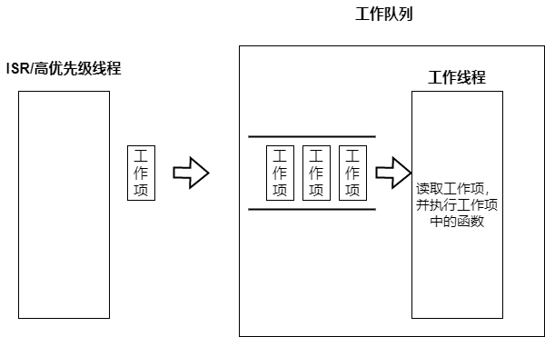

.. _kernel_workq:

工作队列
########

工作队列由一个专用线程和列队组成，专用线程以先进先出的方式处理发送到列队中的工作项。工作队列的线程通常被指定为低优先级线程，中断服务程序或者高优先级线程将非紧急事务转移到工作队列的专用线程中处理，以此降低对时间敏感事物的影响。在Zephyr中工作队列被作为内核对象提供出来，而其它大多数RTOS需要使用者自己使用线程和消息队列来实现工作队列。

|image0|

只要内存足够在Zephyr可以创建任意数量的工作队列，一个工作队列就会有一个工作线程，工作线程的优先级可以配置为协助或者抢占。当列队中无工作项时工作线程处于睡眠状态。当使用者向工作队列发送工作项时，工作项被加入到列队同时通知工作线程处理，工作线程从列队中取出工作项执行，工作线程在执行工作项之间会使用\ ``k_yield``\ 以防止协作类型的工作线程一直占用CPU饿死其它线程。

一个工作队列的三大要素：

-  工作项：中断服务程序或高优先级线程的非紧急事务

-  列队：用于保存还没处理的工作项

-  工作线程：处理工作项中携带的事务

工作项
======

工作项带有一个工作处理函数，当工作线程处理该工作项时就调用该工作处理函数。工作项在生命周期内有如下状态：

-  悬空：被发送者初始化

-  排队(**queued**)：\ ``K_WORK_QUEUED``
   工作项被发送放到列队中，但还未执行

-  预约(**scheduled**): ``K_WORK_DELAYED``
   延迟工作项(后文说明)在等待超时

-  运行(**running**)：\ ``K_WORK_RUNNING`` 工作项正在被工作线程处理

-  弃用(**canceling**): ``K_WORK_CANCELING`` 弃用正在被处理的工作项

工作项可能会同时拥有以上几种状态的组合，例如启用一个正在执行的工作项，这个工作项的状态就是\ ``K_WORK_RUNNING | K_WORK_CANCELING``

用户定义工作队列
================

只要内存足够用户可以定义任意数量的工作队列，创建一个工作队列需要通过初始化和启动两步完成，工作队列的线程是在启动工作队列时才创建

.. code:: c

   /* 工作队列线程的属性 */
   #define USER_WQ_STACK_SIZE 4096
   #define USER_WQ_PRIORITY 5

   /* 定义工作队列线程的堆栈 */
   K_THREAD_STACK_DEFINE(user_wq_stack_area, USER_WQ_STACK_SIZE);

   /* 初始化工作队列 */
   struct k_work_q user_work_q;
   k_work_queue_init(&user_work_q);

   /* 启动工作队列 */
   k_work_queue_start(&user_work_q, user_wq_stack_area,
                       K_THREAD_STACK_SIZEOF(user_wq_stack_area), USER_WQ_PRIORITY,
                       NULL);

发送工作项到指定的工作队列，工作队列线程一旦无其它前置的工作项时将立即处理该工作项。

.. code:: c

   /* 初始化工作项，为其指定工作函数user_work_handler */
   struct k_work work;
   k_work_init(&work, user_work_handler);

   /* 将工作项发送到 user_work_q的工作队列处理 */
   k_work_submit_to_queue(&user_work_q, &work);

对用户定义的工作队列可以进行排空操作

.. code:: c

   /* 排空user_work_q的工作项，第二个参数plug设置未true表示排空后仍然不接受新的工作项提交 */
   k_work_queue_drain(&user_work_q, true);

排空函数会一直阻塞直到工作队列中所有工作项执行完成后才会返回，在排空执行期间被排空的工作队列只接受自己工作线程提交的工作项，不接受中断服务程序和其它线程提交的工作项。排空结束后工作队列会根据第二个参数\ ``plug``\ 判断是否接受新的工作项，如果\ ``false``\ 表示排空后可以立即接受新的工作项提交，如果为\ ``true``\ 需要做unplug动作做释放动作让工作队列可以继续接受新的工作项

.. code:: c

   /* 释放plug的工作队列，可以继续接受新的提交的工作项 */
   k_work_queue_unplug(&user_work_q);

系统工作队列
============

zephyr在\ ``POST_KERNEL``\ 初始化阶段会创建一个系统工作队列\ ``k_sys_work_q``

.. code:: c

   SYS_INIT(k_sys_work_q_init, POST_KERNEL, CONFIG_KERNEL_INIT_PRIORITY_DEFAULT);

该工作队列的线程优先级通过\ ``CONFIG_SYSTEM_WORKQUEUE_PRIORITY``\ 配置，默认\ ``-1``\ ，属于不可抢占的协作线程。通过\ ``CONFIG_SYSTEM_WORKQUEUE_NO_YIELD``\ 配置系统工作队列在处理完一个工作项后是否执行\ ``k_yield``\ ，默认为\ ``n``\ 表示需要执行

.. code:: c

   static int k_sys_work_q_init(const struct device *dev)
   {
       ARG_UNUSED(dev);
       struct k_work_queue_config cfg = {
           .name = "sysworkq",
           .no_yield = IS_ENABLED(CONFIG_SYSTEM_WORKQUEUE_NO_YIELD),
       };

       k_work_queue_start(&k_sys_work_q,
                   sys_work_q_stack,
                   K_KERNEL_STACK_SIZEOF(sys_work_q_stack),
                   CONFIG_SYSTEM_WORKQUEUE_PRIORITY, &cfg);
       return 0;
   }

从上面的实现可以看到，系统工作队列也是使用的\ ``k_work_queue_start``\ 创建，因此其工作原理和用户定义的一致。

由于新建一个工作队列要创建线程，需要较多内存资源，因此一般建议只使用系统工作队列。只有当工作项会影响到系统工作队列的时才另建立工作队列处理该工作项，例如一个工作项会长时间阻塞影响系统工作队列中后续的工作项，这就需要新建工作队列来单独处理。

系统工作队列已经在zephyr初始化阶段创建好，因此只用初始化一个工作项进行发送执行即可，系统工作队列线程一旦无其它前置的工作项时将立即处理该工作项

.. code:: c

   struct k_work work;
   k_work_init(&work, user_work_handler);
   k_work_submit(&work);

对工作项的操作
==============

无论是提交到系统工作队列还是用户工作队列的工作项都可以使用下列API进行操作

.. code:: c

   struct k_work_sync sync;

   /* 等待work执行完成后才返回 */
   k_work_flush(&work, &sync);

   /* 异步取消work立即返回，列队等待的work将被移除，已经再执行的work依然执行完 */
   k_work_cancel(&work);

   /* 同步取消work，列队等待的work将被移除，已经再执行的work依然执行完,等到执行完后才会返回 */
   k_work_cancel(&work, &sync);

延迟工作项
==========

当中断服务程序或高优先级线程希望工作项在指定时间后才执行，可以通过延迟工作项来完成，通过设置预定时间，延迟工作项会在指定时间后才提交到工作队列中。
前面提到过工作队列排空时不会接受工作队列线程以外的工作项提交，但延迟工作项在预约时间到时的提交不受到该限制。

**注意**\ ：延迟工作项只是延迟提交到工作队列，因此只能保证在指定时间后执行，不能保证在指定时间点执行。例如指定20ms后执行，会在20ms后提交到工作队列，此时如果队列中有其它前置工作项，会等其它前置工作项完成后才会执行。

延迟工作项的使用方法如下：

初始化
------

.. code:: c

   /* 初始化一个延迟工作项 */
   struct k_work_delayable delay_work;
   k_work_init_delayable(&delay_work, delay_work_handler);

预约
----

一个延迟工作项既可以预约到系统工作队列也可以预约到用户工作队列，当预约时间到的适合工作项会被提交到工作队列中

**系统工作队列**

.. code:: c

   /* 300ms后将延迟工作项提交到系统工作队列中*/
   k_work_schedule(&delay_work, K_MSEC(300));

**用户工作队列**

.. code:: c

   /* 300ms后将延迟工作项提交到user_work_q工作队列中*/
   k_work_schedule_for_queue(&user_work_q, &delay_work, K_MSEC(300));

对一个处于预约状态尚未提交的延迟工作项再次做`k_work_schedule/k_work_schedule_for_queue`不会改变其预约时间

修改预约
--------

对一个处于预约中的延迟工作项使用下面方法可以更改其预约提交时间

**系统工作队列**

.. code:: c

   /* 将系统工作队列delay_work的预约时间修改为3000ms */
   k_work_reschedule(&delay_work, K_MSEC(3000));

**用户工作队列**

.. code:: c

   /* 将用户工作队列user_work_q中delay_work的预约时间修改为3000ms */

   k_work_reschedule_for_queue(&user_work_q, &delay_work, K_MSEC(3000));

取消延迟工作项
--------------

取消分为三种状态处理：

-  工作项处在预约等待状态，取消预约定时器

-  工作项处于列队等待状态，从列队中移除

-  工作项处于运行状态，标记取消，不会中止运行

取消延迟工作项分为异步和同步两种，异步取消只是通知取消不会等待真正的取消就会退出。例如如果取消一个正在运行的工作项，同步取消函数会等到运行完毕后才会返回。

**异步取消**

.. code:: c

   k_work_cancel_delayable(&delay_work);

**同步取消**

.. code:: c

   k_work_cancel_delayable_sync(&delay_work);

等待执行
--------

执行等待执行时如果延迟工作项在预约状态将取消预约并立即提交到工作队列，并等到执行完成后才返回

.. code:: c

   struct k_work_sync sync;

   /* 延迟工作项被立即提交到工作队列，等待执行完后才返回 */
   k_work_flush_delayable(&delay_work, &sync);

延迟工作项状态获取
------------------

下列函数获取延迟工作项的状态

.. code:: c

   /* 返回0表示没有工作，非0表示延迟工作项在忙，非0是由工作项的四种状态组成 */
   int busy = k_work_delayable_busy_get(&delaywork);

   /* 返回false表示没有工作，返回true表示工作项在忙 */
   bool pending = k_work_delayable_is_pending(&delaywork);

   /* 返回延迟工作项在第几个绝对tick时被提交到工作队列 */
   k_ticks_t expires = k_work_delayable_expires_get(&delaywork);

   /* 返回延迟工作项还有多少个tick才被提交到工作队列中 */
   k_ticks_t remaining = k_work_delayable_remaining_get(&delaywork);

用户空间工作队列
================

用户空间工作队列是专用在用户空间的工作队列，其内存地址被保护和内核空间隔离，一般只用于zephyr应用程序中。用户空间工作队列的基本构成和工作队列一致：拥有一个队列和工作线程，但结构更为简单，只提供以下4个API，除提交工作项的处理外无法做其它额外的操作。用户空间的工作项也只拥有\ ``K_WORK_USER_STATE_PENDING``\ 和非pending两种状态，分别代表工作项等待运行和已经运行。

.. code:: c

   #define USER_SP_WQ_STACK_SIZE 4096
   #define USER_SP_WQ_PRIORITY 5

   /* 定义用户空间工作队列线程的堆栈 */
   K_THREAD_STACK_DEFINE(user_wq_space_stack_area, USER_SP_WQ_STACK_SIZE );

   /* 启动一个用户空间的工作队列 */
   struct k_work_user_q user_space_work_q;
   k_work_user_queue_start(&user_space_work_q,
                       user_wq_space_stack_area,
                       USER_SP_WQ_STACK_SIZE , USER_SP_WQ_PRIORITY ,
                       NULL);

   /* 初始化一个用户空间的工作项 */
   struct k_work_user user_space_work;
   k_work_user_init(&user_space_work, work_user_handler);

   /* 发送工作项到用户空间工作队列 */
   k_work_user_submit_to_queue(&user_space_work_q, &user_space_work);

   /* 查询用户空间的工作项是否处于pending，还未执行处于pending，正在或已经执行完成为非pending */
   bool pending = k_work_user_is_pending(&user_space_work);

其它
====

工作队列中还有一种叫触发工作，其工作项和轮询内核对象绑定，这部分实现在轮询内核对象中，本文不做介绍。

参考
====

https://docs.zephyrproject.org/latest/kernel/services/threads/workqueue.html

