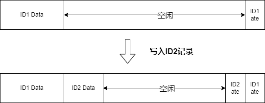
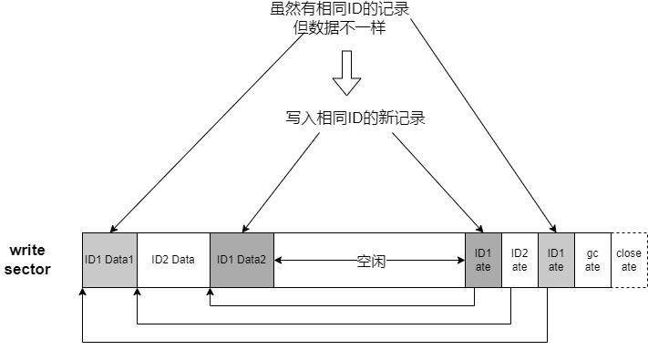
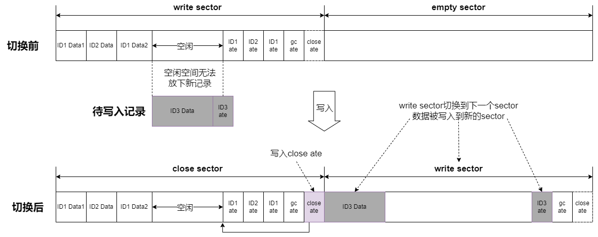
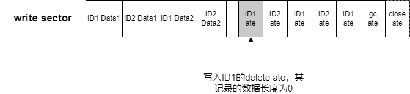

.. _storage_nvs_analyze:

Zephyr NVS原理分析
#########################

基本概念
========

Zephyr NVS基于Flash之上提供一个简易的文件系统。其目标是利用Flash的特性，解决Flash在存储数据上的缺点。

Flash的特性：

* 有数据的位置，再次写入前必须先擦除
* 擦除总次数有限制
* 擦除单位为页 
* 不同的Flash会有写入对齐要求
* 读出数据无限制

由Flash的特性导致的缺点：

* 无论写多少数据，都要先进行页擦除
* 擦除耗时，导致写入耗时
* 频繁的擦除会降低Flash的使用寿命
* 写入对齐对写入数据的位置和长度有限制

因此设计NVS的时候，主要是目标：

* 不是每次写入数据时都做擦除动作
* 降低擦除Flash的次数，增加Flash的寿命
* 屏蔽写入对齐的限制

NVS扇区
~~~~~~~

NVS以扇区sector进行管理：

* 一个NVS由2个或以上的扇区组成
* 一个扇区由Flash的1个或者多个页组成。

NVS和Flash的关系如下图：

.. image:: ../../../images/develop/subsys/storage/nvs-flash.png

由于扇区和Flash的页是对齐的，所以对扇区进行擦除动作时可以直接使用Flash擦除API，而无需额外的代码。

NVS记录
~~~~~~~

写入NVS的数据叫做NVS记录，写入时用ID标识记录，一个ID标识一条记录，ID的长度为16bit，因此NVS内的记录不会超过65536条。在NVS中一条记录被分为两部分

* 记录分配表 ate： Allocation Table Entry，用于记录数据的ID和数据在扇区中的信息。
* 记录的数据

在\ ``zephyr\subsys\fs\nvs\nvs_priv.h``\中定义ate的结构

.. code:: c

    struct nvs_ate {
        uint16_t id;	/* 数据的ID */
        uint16_t offset;	/* 数据在扇区内的偏移 */
        uint16_t len;	/* 数据的长度 */
        uint8_t part;	/*  */
        uint8_t crc8;	/* crc8 check of the entry */
    } __packed;

从ate的结构体可以看出NVS记录的数据长度用`uint16_t`记录，因此NVS一条记录的数据长度最多为64K。

当NVS写入一条记录时ate和其指向的数据在物理位置上是分开的，ate从扇区的最后向前生长，而数据从扇区的最前面向后生长。

特殊定义
~~~~~~~~

基于NVS的设计，为了方便后续的说明，这里约定一些特殊定义：

ate相关
^^^^^^^^

* last ate
  
  * 最近一次写入的ate

* close ate
  
  * \ ``id=0xFFFF``\  
  * \ ``len=0``\ 
  * \ ``offset``\指向该扇区最后写入的ate  
  * close ate固定位于扇区的最末尾，不指向任何数据，用于标识扇区已被关闭

* gc ate
  
  * \ ``id=0xFFFF``\  
  * \ ``len=0``\
  * \ ``offset``\指向gc ate自己  
  * gc ate固定位于close ate前，不指向任何数据，用于标识该扇区的数据是被垃圾回收过的

* delete ate
  
  * \ ``id``\为被删除数据的id  
  * \ ``len=0``\  
  * \ ``offset=0``\  
  * delete ate用于标识某个id的数据被删除

扇区相关
^^^^^^^^^

* open sector 不含有有效close ate的扇区
* close sector 含有有效close ate的扇区
* write sector 当前可写入的扇区
* empty sector 被擦除后，内容为全FF的扇区

原理说明
========

NVS将扇区当作循环缓冲进行管理，写入记录被添加到扇区内，当一个扇区被写满后切换到下一个扇区。

写入
~~~~

NVS写入记录时，不会擦除老的记录，而在最新的位置写入记录，ID的有效数据只是最新记录的这一条。这种写入时不擦除的操作大大的降低了对Flash的擦除次数。

常规写入
~~~~~~~~

NVS写入记录时对write sector进行写入遵循下面步骤：

1. 检查是否有相同记录：ID相同且数据相同，不需要再次写入
2. 如果没有相同记录，写入新的记录

.. note::

    判断相同的标准时ID和数据都相同，就算是查到有相同的ID，数据不同也需要写入

切换扇区
~~~~~~~~

当写入数据时发现write sector的空闲空间无法容纳新的记录时，进行扇区切换，遵循下面步骤：

1. write sector剩余空间小于写入记录的data len+ate size，写入close ate
2. write sector切换为下一个sector，写入记录

NVS在写入ate和数据时，会参考Flash写入对齐的要求，分别对ate和数据进行对齐补齐。

读出
~~~~~~~~

从写入分析可以知道，NVS中会存在多条相同的ID的记录，只需要找出最近一次与ID匹配的写入记录既可。下图示例要读出ID1的记录

.. image:: ../../../images/develop/subsys/storage/nvs-read.png

删除
~~~~~~~~

同样为了避免删除记录导致Flash擦除，删除时只是写入一个delete ate

次数如果再去读ID1的记录，会去找最近写入的ID1 的ate，也就是delete ate，表示ID1的记录已经从NVS内删除而读不到数据。

垃圾回收
~~~~~~~~

由于对同ID的多次操作将导致NVS中含有大量的冗余数据

* 从写入机制可知：NVS内可能会存在多笔同ID的数据，但只有最后一笔有效。
* 从删除机制可知：即使ID的数据从NVS内删除，但任然占用Flash空间。

NVS引入了垃圾回收机制处理这些冗余：

* NVS永远保留一个扇区为empty sector
* 当写NVS引发扇区切换时进行垃圾回收
* 一次垃圾回收只处理一个扇区
* 垃圾回收的扇区是即将要写入扇区的下一个扇区

一次写入引发的垃圾回收过程如下图，其中虚线框中的2，3，4是垃圾回收过程：

.. image:: ../../../images/develop/subsys/storage/nvs-gc.png

1. 写入的ID1记录比扇区B的剩余空间大
2. 将B扇区关闭，切换到C扇区
3. 对A扇区进行垃圾回收   
   1. A扇区中ID2的数据为最新数据，搬运到C扇区   
   2. A扇区中的ID1在B扇区中有更新的数据，不需要搬运   
   3. 其它A扇区中的数据都是冗余数据，无需搬运
4. A扇区被回收完后将A扇区擦除，将C扇区标识为已完成垃圾回收
5. C扇区的数据可以容纳要写入ID1的数据，写入ID1最新的数据
6. 当C扇区被写满后，下一次将对B扇区进行垃圾回收，然后擦除B扇区。这样循环往复。

从上面分析可以看到NVS的擦除是在其管理的扇区中循环进行的，这种机制可以均衡对Flash的磨损，从整体上延长Flash的寿命。垃圾回收付出的代价是要浪费一个扇区无法写数据，因此在创建NVS时需要评估写入单笔记录数据的最大长度，尽量配置小的扇区减少浪费。

NVS创建与恢复
~~~~~~~~~~~~~~~~

NVS本身不存在创建格式化的问题，只要指定了NVS在Flash中的位置以及扇区大小和个数，NVS会按照初始化的信息进行操作。如果Flash中之前没有写过NVS，NVS会自己进行擦除操作。如果Flash之前有NVS，初始化的时候会通过下面步骤进行恢复：

1. 遍历扇区，找到close sector之后的open sector，将其设置为write sector
2. 如果全部是open sector，那么第一个扇区作为write sector
3. 检查write sector之后是否为empty sector，如果不是   
   1. write sector如果无gc ate，擦除write sector，做gc   
   2. write sector如果有gc ate，擦除下一个sector

总结
=====

Zephyr NVS代码实现相对复杂，通过本文可以理解Zephyr NVS的设计思想和工作原理，为分析Zephyr NVS打基础。Zephyr NVS对Flash进行封装，通过冗余扇区减轻Flash的两个缺点带来的影响：

* 写入/删除时只写不擦除，降低Flash磨损，增加Flash使用寿命。
* 垃圾回收时循环擦除，均衡Flash磨损，增加Flash整体寿命。

参考
=====

https://docs.zephyrproject.org/latest/reference/storage/nvs/nvs.html