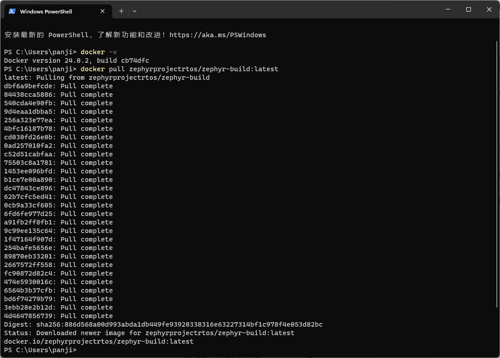
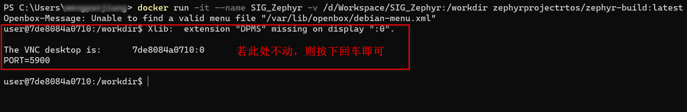
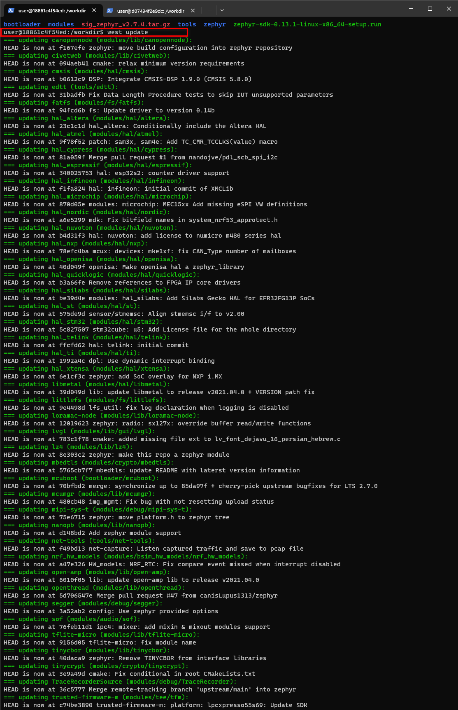
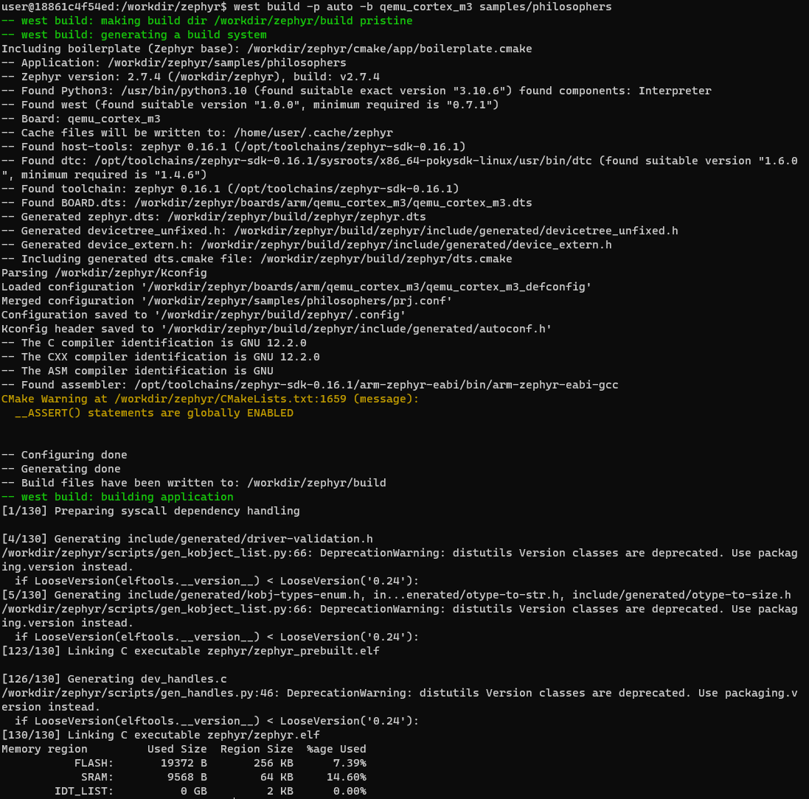
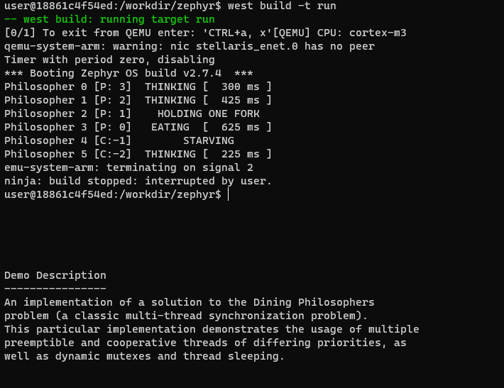

.. _develop_windows_docker:

Windows下基于Docker Desktop开发环境的搭建
##########################################

本章主要介绍一种基于Windows平台，使用Docker Desktop搭建的开发环境，该开发环境搭建更为简单、便捷。为国内开发者提供另一种开发环境搭建方案的选择。
该方案的思路是在windows平台下安装docker desktop，然后拉取Zephyr Project官方的image，基于该image创建容器，随后进入容器完成开发文件的布局后，
即可开始正式的编译和开发。其实思路和在windows下创建linux虚拟机进行开发是一样的，只不过使用docker来进行部署会相比虚拟机更加轻便，容易，简单。

准备阶段
===========

该部分主要准备本方案中所使用到的工具、文件等，便于后续正式部署时使用。

    * 下载整个Zephyr projcet文件，该文件是基于Zephyr LTS 2.7.4版本，并按照Zephyr工程文件布局进行打包的。 `下载链接 <https://www.aliyundrive.com/s/f8oysE4vPDJ>`_
    * 下载Zephyr SDK ，该SDK为“zephyr-sdk-0.13.1-linux-x86_64-setup.run”。 `下载链接 <https://www.aliyundrive.com/s/xgDJoiYhPmF>`_
    * 下载windows终端，便于输入命令。 `下载链接 <https://learn.microsoft.com/zh-cn/windows/terminal/install>`_
    * 阅读docker基础知识，重点关注使用和基本命令。 `链接 <https://www.runoob.com/docker/docker-tutorial.html>`_

Dokcer Desktop
====================

下载安装Docker Desktop
~~~~~~~~~~~~~~~~~~~~~~~
通过链接下载对应系统架构的Docker Desktop V4.18.0. 并进行安装。 `下载链接 <https://docs.docker.com/desktop/release-notes/#4180>`_

配置Docker Dektop
~~~~~~~~~~~~~~~~~~~
配置Docker Dektop主要有两个操作。

1. 修改image存储位置。

因为image默认是存放在C盘，避免C盘占用过多，所以将image存储位置进行修改。

参考链接 `【Docker】win10上修改docker的镜像文件存储位置（九）- 通过WSL2修改 <https://blog.csdn.net/u013948858/article/details/111464534>`_

2. 修改image源。

因为Docker Dektop的默认源部署在海外，访问不稳定，所以对源进行修改，加速访问。

参考链接 `Windows Docker 配置国内镜像源的两种方法 <https://blog.csdn.net/Lyon_Nee/article/details/124169099>`_

以上配置在参考链接中均有检查环境，请自行参考链接进行检查。

拉取Zephyr-build image
========================
.. note::

    Desktop Hub类似于github，是Desktop官方专门给用户存放公共imgae的地方。其操作逻辑和在github拉取代码、推送代码是一样的。

1. 在Windows终端输入以下命令，从Desktop Hub拉取拉取zephyr-build image

.. code-block:: bash

  docker pull zephyrprojectrtos/zephyr-build:latest
    

下载完成后的页面如下图所示。

2. 使用命令查看已经下载好的image，可以看到有一个zephyrprojectrtos/zephyr-build的image

.. code-block:: bash

  PS C:\Users\panji> docker images
  REPOSITORY                       TAG       IMAGE ID       CREATED        SIZE
  zephyrprojectrtos/zephyr-build   latest    de8729afe80c   3 weeks ago    12.1GB

创建并进入容器
===============

创建并启动容器，并将本地的目录D:/Workspace/SIG_Zephyr挂在到容器的/workdir中。

.. note::
  此处进行文件夹的挂载主要是为了方便在windows下直接访问容器类的文件夹，类似与linux服务和windows使用samba进行文件文件传输。
  参考链接 `docker挂载Win10本地目录 <https://blog.csdn.net/weixin_39400835/article/details/101905090>`_

.. code-block:: bash

  PS C:\Users\panji> docker images
  docker run -it --name SIG_Zephyr -v /d/Workspace/SIG_Zephyr:/workdir zephyrprojectrtos/zephyr-build:latest
  
命令运行后如下图所示。

容器中部署Zephyr
===================
1. 将sig_zephyr_v2.7.4.tar.gz和zephyr-sdk-0.13.1-linux-x86_64-setup.run放在D:/Workspace/SIG_Zephyr文件中，此时可以在容器中对应挂载的文件也能看到该文件.

.. code-block:: bash

  user@18861c4f54ed:/workdir$ ls
  sig_zephyr_v2.7.4.tat.gz  zephyr-sdk-0.13.1-linux-x86_64-setup.run

2. 解压sig_zephyr_v2.7.4.tar.gz到/wordir文件夹

.. warning::
  因为分享链接下载的exe文件，双击就能够解压出sig_zephyr_v2.7.4.tar.gz文件。

.. code-block:: bash

  user@18861c4f54ed:/workdir$ tar -xvzf sig_zephyr_v2.7.4.tar.gz 
  user@18861c4f54ed:/workdir$ ls -a
  .  ..  bootloader  modules  sig_zephyr_v2.7.4.tar.gz  tools  .west  zephyr  zephyr-sdk-0.13.1-linux-x86_64-setup.run

使用ls -a可以看到在workdir文件夹中多了几个个文件夹.west、bootloader、modules、tools、zephyr，这5个文件夹即是整个zephyr 的项目文件夹。

3. 在workdir文件夹中运行west update。

.. code-block:: bash

  west update

.. note::
  此步骤可以省略，不过可以用来检验整个zephyr 项目文件夹是否建立正常。

命令运行后如下图所示。

4. 安装SDK

  此步骤完全参考zephyr官方文档进行操作。详情查看 `Getting Started Guide <https://docs.zephyrproject.org/2.7.5/getting_started/index.html>`_ 中的Install a Toolchain章节，可以跳过Download the latest SDK installer步骤。

编译及运行
============
上述所有准备工作完成之后，可以尝试构建Zephyr应用了。

编译
~~~~~~~
先进入到zephyr目录下，再进行编译。
    
.. code-block:: bash

  user@18861c4f54ed:/workdir/zephyr$ cd zephyr
  user@18861c4f54ed:/workdir/zephyr$ west build -p auto -b qemu_cortex_m3 samples/philosophers

编译如下图所示：

运行
~~~~~~
使用命令对上述编译进行仿真运行。

.. code-block:: bash
  
  user@18861c4f54ed:/workdir/zephyr$ west build -t run

运行结果如下图所示。

运行后可以看到终端有字符一直再变动，其实这是qemu在对例程进行运行，ctrl+c可以中止例程运行。

Docker相关操作
===============
1. 如何退出Docker容器？

   容器中输入exit即可退出容器；

2. 容器停止运行后如何启动和进入？

   启动容器命令：docker start 容器名  
   进入容器命令：docker attach 容器名

3. vscode如何访问Docker容器？

   安装Docker插件，找到对应的容器访问即可。

.. note::

    若对Docker相关操作不熟悉，请先花时间阅读准备阶段的Docker学习链接，熟悉相关操作。

参考文档
============
以下文档均在本文相关操作中提供过帮助。

1. `west命令详解：init&update <http://www.sunyouqun.com/2020/04/west-cmd-init-update/>`_

2. `docker挂载Win10本地目录 <https://blog.csdn.net/weixin_39400835/article/details/101905090>`_

3. `Windows Docker 配置国内镜像源的两种方法 <https://blog.csdn.net/Lyon_Nee/article/details/124169099>`_

4. `【Docker】win10上修改docker的镜像文件存储位置（九）- 通过WSL2修改 <https://blog.csdn.net/u013948858/article/details/111464534>`_
